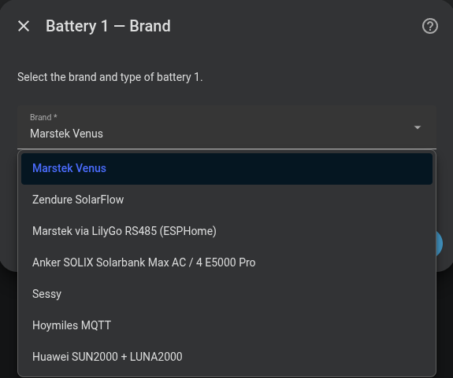

# ESPHome / LilyGo RS485

Use this route to bring a Marstek Venus E into Omnibattery through a LilyGo board running ESPHome. It keeps battery control in Home Assistant when the board is already connected to the battery's RS-485 port, rather than connecting to the battery with Modbus TCP.

## Do I need it?

| Battery | Connection route | Choose this route when |
|---|---|---|
| Marstek Venus E with the v2 register map | LilyGo RS485 bridge exposed through ESPHome | The bridge is already installed and appears as an ESPHome device in Home Assistant |

**Use it if** you have the supported LilyGo/ESPHome bridge and want Omnibattery to use the battery entities it exposes. **You do not need it if** Home Assistant reaches the battery directly through Modbus TCP, a Modbus gateway, or a serial adapter; use [Marstek Venus](marstek.md) instead.

This route is for Venus E. It is not a route for Venus A, Venus D, or Venus E v3.

## Before you start

- Install the [marstek-lilygo-rs485 firmware project](https://github.com/whyisthisbroken/marstek-lilygo-rs485) on a LilyGo T-CAN485 board and add it to Home Assistant through ESPHome. For wiring and firmware installation, see that project.
- Confirm that the ESPHome device is online and its battery entities use the firmware's stock names.
- Confirm that the battery's **Battery State Of Charge**, **Battery Power**, and **AC Power** entities have usable values.

## How to add it

1. Open **Settings → Devices & services → Omnibattery → Configure**. Add a battery if the installation does not already have one.
2. At the battery brand step, select **Marstek via LilyGo RS485 (ESPHome)**.
3. In **Configure battery {battery number} — Connection (LilyGo/ESPHome)**, enter a **Name** and select the **ESPHome device** that represents the LilyGo bridge.
4. Continue to **Configure battery {battery number} — Limits** and set **Maximum charge power (W)**, **Maximum discharge power (W)**, **Maximum SOC (%)**, and **Minimum SOC (%)** for the battery.

{ width="650" style="display: block; margin: 0 auto;" }

## What you will see

Omnibattery provides automatic charge/discharge control and the usual Marstek controls, including **Force Mode**, **Set Forcible Charge Power**, **Set Forcible Discharge Power**, **Max Charge Power**, **Max Discharge Power**, and hardware state-of-charge cutoffs.

You will also see battery state of charge (SOC), battery and AC power, energy counters, temperature, voltage, cell-voltage, inverter-state, and connection diagnostics when the firmware publishes them. Telemetry normally updates on the bridge's approximately 3-second battery poll.

Unlike a direct Modbus connection, Omnibattery does not communicate with the battery itself on this route: it reads and writes the ESPHome entities. There is no MPPT solar telemetry, and individual warning entities replace aggregate alarm registers.

## If it does not work

| Symptom | Likely cause | What to check |
|---|---|---|
| The LilyGo board is not offered as an **ESPHome device** | ESPHome has not added the board as a device, or it is offline | Check the ESPHome integration and confirm the board is online in Home Assistant |
| The wizard says required entities are missing | The board is not using the supported firmware, or its entity names were changed | Install the supported firmware and restore its stock entity names; see the required names below |
| Setup completes but the battery is unavailable | The bridge is online but **Battery State Of Charge** is `unknown` or `unavailable` | Check that the battery and bridge are communicating, then wait for a usable SOC value |
| Commands have no effect | A required ESPHome control entity is unavailable or the bridge is not reaching the battery | Check **Forcible Charge-Discharge**, **Forcible Charge Power**, **Forcible Discharge Power**, and **RS485 Control Mode** in the ESPHome device |
| Values stop changing while the board still looks online | The bridge's battery polling has stalled | Check the ESPHome logs and the RS-485 connection; Omnibattery stops using stale battery telemetry rather than control from old values |

??? "Advanced details"
    Omnibattery identifies this connection by the selected Home Assistant ESPHome device, not by an IP address or Modbus endpoint. The bridge owns the RS-485 connection, so this route has no parallel direct Modbus path.

    Entity matching uses the ESPHome entity registry's original name, converted to a slug. Renaming an entity ID in Home Assistant therefore normally does not break matching. The required stock entity names are **Battery State Of Charge**, **Battery Power**, **AC Power**, **Forcible Charge-Discharge**, **Forcible Charge Power**, **Forcible Discharge Power**, and **RS485 Control Mode**.

    Commands use Home Assistant's `select.select_option` and `number.set_value` services. The bridge polls the battery every approximately 3 seconds; Omnibattery treats all battery-sourced telemetry as stale after 120 seconds without any report, even if ESP-local Wi-Fi entities are still updating.
