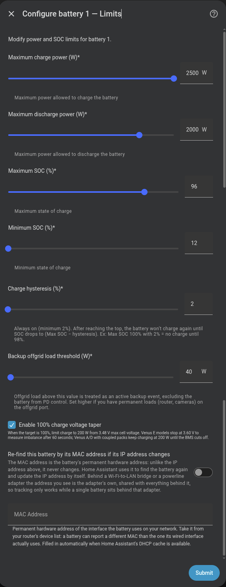

# Choose your battery connection

Choose the route that matches your battery and the way it is connected to Home Assistant. Omnibattery can coordinate up to ten supported batteries, including mixed-brand installations.

## Choose a battery brand

| What you own | What you need | Select in the wizard | Setup guide |
|---|---|---|---|
| Marstek Venus connected directly or through a Modbus gateway | A reachable Ethernet, RS-485, or USB connection | **Marstek Venus** | [Marstek](marstek.md) |
| Marstek Venus connected through a LilyGo bridge | The supported ESPHome firmware and its device in Home Assistant | **Marstek via LilyGo RS485 (ESPHome)** | Dedicated guide not yet available |
| Zendure SolarFlow | The device's local IP address and HEMS disabled | **Zendure SolarFlow** | [Zendure](zendure.md) |
| Anker SOLIX Solarbank | Modbus TCP and Third-Party Control enabled | **Anker SOLIX Solarbank Max AC / 4 E5000 Pro** | [Anker SOLIX](anker.md) |
| Sessy Home Battery | A reachable Sessy dongle and its credentials | **Sessy** | [Sessy](sessy.md) |
| Hoymiles MS-A2 or supported HiBattery | MQTT configured in Home Assistant and the complete device ID | **Hoymiles MQTT** | [Hoymiles MQTT](hoymiles.md) |
| Huawei SUN2000 with LUNA2000 | A Modbus TCP endpoint and either Huawei Solar or direct Modbus writes | **Huawei SUN2000 + LUNA2000** | [Huawei](huawei.md) |

{ width="650" style="display: block; margin: 0 auto;" }

The LilyGo option is a separate connection route for a Marstek battery. Choose it only when ESPHome already exposes the bridge as a device in Home Assistant.

## Add each battery

1. Open **Settings → Devices & services → Add integration** and select **Omnibattery**. For an existing installation, open Omnibattery and choose **Configure**.
2. Choose the number of battery units in the installation.
3. Select the brand or connection route for the first battery.
4. Follow its setup guide, then repeat the brand and connection steps for each remaining unit.
5. Complete the common power and state-of-charge limits.

{ width="650" style="display: block; margin: 0 auto;" }

{ width="650" style="display: block; margin: 0 auto;" }

## Common settings

| Setting | What it changes |
|---|---|
| **Name** | Identifies the battery in Home Assistant and the Omnibattery dashboard. |
| **Max charge power** / **Max discharge power** | Caps what Omnibattery may request. A device-reported hardware limit can reduce the effective value. |
| **Max SOC** / **Min SOC** | Sets the upper charging limit and lower discharging limit. SOC means state of charge. |
| **Charge hysteresis** | Prevents rapid cycling after the battery reaches its upper limit. The minimum is 2%. |
| **Backup Offgrid Threshold** | Keeps a battery out of automatic control while its backup output is serving a load above this value. |
| **Nominal capacity** | Enables stored-energy and efficiency calculations when the battery does not report its capacity. |

The integration creates runtime controls for state-of-charge and power limits, so you can adjust them without running the setup flow again. **Battery Manual Control** reserves one battery for your own charge, discharge, or idle commands; see [manual control in a multi-battery installation](../../features/multi-battery.md#manual-control-per-battery).

## If the battery route is unclear

| Symptom | Likely cause | What to check |
|---|---|---|
| Your model is absent from the table | The driver may support a family that is not yet documented, or the model may be unsupported | Compare the exact model name with the relevant brand page before configuring it |
| The wizard cannot connect | A product option, local protocol, address, or credential is missing | Complete the brand page's **Before you start** checklist |
| The battery connects but ignores commands | The manufacturer's own energy-management mode still owns control | Check the brand-specific app setting and **Battery Manual Control** |
| A limit is lower than expected | The detected device envelope is lower than the configured software limit | Check the model table and the limit reported by the battery |

??? "Advanced details"
    Omnibattery asks for each battery separately, so supported brands can be mixed in one installation. Individual battery limits always apply even when system-level charge or discharge caps are configured. Setting either system cap to `0 W` disables that cap.

    Runtime power and state-of-charge limits are persisted and restored after a Home Assistant restart. **Battery Manual Control** first verifies an idle target, removes the battery from the automatic pool, and also restores that ownership after restart.

    **Backup Offgrid Threshold** defaults to `50 W`. Leave it at zero when no standby load is connected, or set it above the normal permanent backup-port load so a router or network switch does not look like a backup event. When **Backup Function** is enabled and the measured load exceeds the threshold, Omnibattery excludes the battery from proportional–derivative (PD) control. It waits `5 min` after the load falls before returning the battery to the automatic pool.

    Related configuration:

    - [Time slots](../time-slots.md) control when batteries may charge or discharge.
    - [Predictive charging](../predictive-charging/index.md) can schedule grid charging.
    - [Multi-battery management](../../features/multi-battery.md) explains power sharing and manual ownership.
