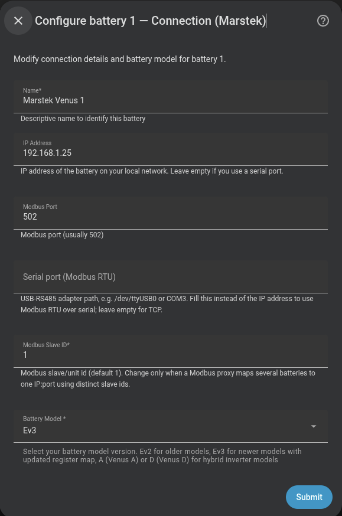

# Marstek Venus

Use this connection for a Marstek Venus battery reached directly over Ethernet, through a Modbus gateway, or through a USB-to-RS-485 adapter. A LilyGo bridge uses its own option in the wizard.

## Do I need it?

| Battery | Wizard version | Maximum charge and discharge power |
|---|---|---:|
| Venus E v2 | **Ev2** | 2,500 W |
| Venus E v3 | **Ev3** | 2,500 W |
| Venus A | **A** | 1,500 W |
| Venus D | **D** | 2,200 W before EMS firmware 149, or when firmware is unknown; 2,500 W from firmware 149 |

**Use this page if** one of these wizard choices matches your battery and you can reach it through Modbus TCP or Modbus RTU. **Use the LilyGo route instead** when a supported ESPHome bridge already exposes the battery in Home Assistant.

## Before you start

- For Venus E v2, prepare an RS-485-to-TCP gateway or a USB-to-RS-485 adapter.
- For Venus E v3, Venus A, or Venus D, confirm that Home Assistant can reach the battery's Ethernet address.
- Know the Modbus slave ID and the exact Venus version.
- If several batteries share one gateway, give each unit its own slave ID.

## How to add it

1. In the Omnibattery setup flow, choose **Marstek Venus**.
2. Enter a battery name and either **Host IP** or **Serial port**. Leave **Serial port** empty for a network connection.
3. Keep **Modbus port** at `502` unless the battery or gateway uses another port.
4. Enter the **Modbus slave ID** and select **Ev2**, **Ev3**, **A**, or **D**.
5. Continue to the limits form and choose values no higher than the model limit above.

{ width="650" style="display: block; margin: 0 auto;" }

## What you will see

Marstek exposes automatic and manual charge/discharge control, state of charge (SOC), power and energy readings, and the sensors available in the selected register map. Solar and alarm readings appear only on models whose map provides them.

Venus E v2 can use hardware SOC cutoffs. Omnibattery enforces the configured SOC limits in software for Venus E v3, Venus A, and Venus D. Venus A and Venus D also ask whether direct-current solar is connected so power-flow calculations can use the correct source.

{ width="650" style="display: block; margin: 0 auto;" }

## If it does not work

| Symptom | Likely cause | What to check |
|---|---|---|
| The wizard reports **Cannot connect** | The address, serial path, port, slave ID, wiring, or selected map is wrong | Test network reachability or the serial adapter, then verify the model and slave ID |
| Values are implausible or unavailable | The selected Venus version uses a different register map | Reconfigure the battery with the exact model version |
| Venus D is limited to 2,200 W | EMS firmware is older than 149 or its version could not be read | Check the EMS firmware before expecting the higher limit |
| A LilyGo-connected battery is missing | The direct Marstek route was selected | Return to the brand step and select **Marstek via LilyGo RS485 (ESPHome)** |
| Charging slows near full | The optional full-charge taper is active | Check **100% Charge Voltage Taper** and the cell-voltage sensors |

??? "Advanced details"
    Marstek uses native force mode and separate charge/discharge setpoints. The available registers depend on the selected version; Omnibattery derives force mode, solar, alarms, hardware SOC cutoffs, and RS-485 control capability from that map.

    The optional **100% Charge Voltage Taper** is Marstek-specific. At a 100% target, it limits charging to `200 W` when the highest measured cell reaches `3.48 V`. Venus E pauses at `3.60 V` and waits `60 s` before evaluating cell imbalance. Coupled-pack Venus A and D systems continue at the taper power until the battery management system (BMS) ends charging. See [Cell balance monitor](../../features/cell-balance-monitor.md).

    A Modbus TCP connection normally uses port `502`; the slave ID accepts the Modbus unit range `1–247`. A serial path such as `/dev/ttyUSB0` or `COM3` selects Modbus RTU instead of the host address.

    For shared state-of-charge controls, system caps, and backup behavior, see [Choose your battery connection](index.md).
