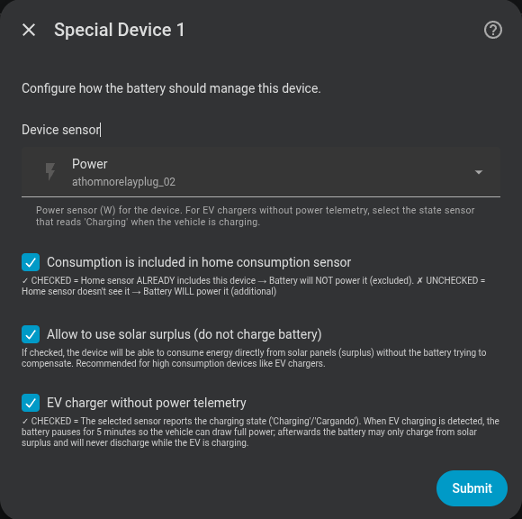

# Excluded devices

Allows you to "mask" heavy loads so the battery does not try to cover them.

## Typical use case

If you have a 7 kW EV charger and a 2.5 kW battery, without exclusion the battery will try to compensate the full charger load and drain quickly. With exclusion active, the controller ignores that power and the battery only manages the rest of the household.

---

## Configuring an excluded device

| Field | Description |
|---|---|
| **Device power sensor** | HA entity measuring the device's numeric power (e.g. `sensor.wallbox_power`). Optional for an EV charger without power telemetry. |
| **Device active / EV charging sensor** | State or binary sensor that reports `on`, `Charging`, `Cargando`, or another recognised charging state. Required by Dynamic Power Control and by new no-telemetry configurations; otherwise optional. |
| **Included in consumption** | Check if your main sensor **already** includes this load |
| **Allow solar surplus** | If enabled, the battery will not charge to compensate this device when there is a solar surplus. Can also be toggled at runtime via a switch entity (see below). |
| **Device has dynamic power control** | Enable for a load such as a surplus-controlled wallbox that adjusts its own demand from a grid meter. Requires **Allow solar surplus**. |
| **Cover home while device is active** | Allow the battery to cover genuine household load while only the device's grid share remains excluded. Requires **Allow solar surplus** and a solar-production sensor. |
| **EV charger without power telemetry** | Check if the sensor is a state sensor that reads `Charging` (or a localised equivalent) instead of a watt value. See [EV charger without power telemetry](#ev-charger-without-power-telemetry) below. |
| **Expected remaining demand (kWh)** | Optional sensor reporting the energy the device still expects to consume today. Predictive charging reserves that share of the remaining solar forecast for the device. See [Expected remaining demand](#expected-remaining-demand) below. |
| **Presence entity for the remaining demand** | Optional. While set, the claim above counts only when this entity reports the device as present. See [Expected remaining demand](#expected-remaining-demand) below. |

### Included in consumption?

```
Main sensor reads: whole house
EV charger is part of "whole house" → ✅ Included in consumption

Main sensor reads: only domestic circuit
EV charger is on a separate circuit → ❌ Not included in consumption
```

The integration uses this setting to correctly calculate the net consumption without the excluded device.

{ width="650"  style="display: block; margin: 0 auto;"}

---

## Solar Surplus switch

For each excluded device a **Solar Surplus** switch entity is automatically created (`Solar Surplus – <device name>`). It mirrors the *Allow solar surplus* setting and can be toggled at any time without entering the options flow.

This makes it possible to change the charging priority from automations — for example:

- Turn ON when the EV is connected, so solar charges the car first.
- Turn OFF at a scheduled time to let the battery capture morning surplus.
- React to battery SOC: turn ON above 80 %, turn OFF below 50 %.

The switch state is persisted in the config entry and survives restarts.

---

## Dynamic power control

Telemetry devices also get a **Dynamic Power Control** switch. It is designed for flexible loads such as wallboxes that regulate themselves from the same grid meter as Omnibattery. Enable it together with **Solar Surplus**.

!!! note "Solar production sensor"
    The **solar-production sensor is recommended** for this control. When it is configured, Omnibattery detects increases of at least 200 W in the available margin (solar production minus device power), including a wallbox power drop, and yields battery charging again for 20 seconds. Without that sensor, it runs a 20-second probe every 5 minutes.

The **Device active / EV charging sensor** lets Omnibattery yield while the wallbox is requesting power but still reads 0 W, avoiding the cold-start deadlock where the battery absorbs all export before the wallbox starts. Omnibattery automatically:

- Bblocks battery charging while the optional activity sensor requests power but the wallbox still reads 0 W.
- Yields battery charging for 30 seconds when device demand rises above 100 W.
- Lets the external controller ramp up before the battery takes residual export.
- Yields again for 20 seconds when the available margin (solar production minus device power) rises by at least 200 W, either because solar production rises or the wallbox reduces power.
- When device power falls, keeps battery discharge blocked for 5 minutes and gives charging a short restart grace so a wallbox can restart after a cloud or phase transition.
- Probes every 5 minutes when no solar-production sensor is available.

Legacy sensor-less Dynamic Power Control entries still fall back to detection at the first measured load above 100 W. Dynamic Power Control is not available for the state-only **EV charger without power telemetry** mode because that mode already manages the battery directly from the same activity sensor.

---

## Exclusion % slider

Exclusion is not all-or-nothing. Each excluded device also gets an **Exclusion %** slider (`<device> – Exclusion %`, `number.*_exclusion_pct`, 0–100 %, default `100`) controlling **how much** of its demand stays off the battery:

- `100 %` (default) — the device is fully masked, exactly as before. The battery covers none of its load.
- `0 %` — the device is treated as normal household load; the battery covers it like anything else.
- e.g. `60 %` — 60 % of the device's power is kept off the battery; the battery may cover the remaining 40 %.

This lets the battery cover *part* of a big load instead of all-or-nothing — for example letting a 2.5 kW battery help with a 7 kW EV charger up to its share, rather than ignoring the charger entirely. The slider is per device and adjustable at runtime.

---

## Expected remaining demand

Predictive charging plans the battery against the remaining solar forecast. That forecast is not
all yours: an excluded device on solar surplus consumes part of it. Left unaccounted, the energy
balance reports "sufficient energy", skips the cheap grid slots, and the battery sits at a low
SOC through a sunny day while the car takes the sun.

Point **Expected remaining demand (kWh)** at a sensor reporting the energy the device still plans
to consume today, and predictive charging reserves that share instead:

```
claim = min(expected remaining demand, remaining solar forecast − safety margin)
solar available to the battery = remaining solar forecast − safety margin − claim
```

Notes:

- The field is optional and off by default. Without it, nothing changes.
- Eligibility follows the consumption correction exactly, so the same demand is never removed
  twice. Only devices with **Included in consumption** checked may claim; a device the home sensor
  does not see is an additional load the battery is meant to cover. **EV charger without power
  telemetry** devices are skipped for the same reason they are skipped there.
- **Exclusion %** scales the claim the same way it scales the consumption correction. At 50 % the
  consumption forecast keeps half the device's demand, so only the other half is reserved.
- The claim is capped at the available solar. Grid energy the device draws beyond the forecast is
  already covered by the consumption forecast.
- The sensor must report an energy unit (kWh, Wh, MJ, …). If it is unavailable, unknown,
  unparsable or carries a non-energy unit, no claim is made.
- evcc publishes a suitable entity per loadpoint: `sensor.evcc_<loadpoint>_charge_remaining_energy`.
- **That sensor does not go to zero when the car leaves.** evcc derives it from the vehicle's SOC
  target, so it keeps reporting a demand with nothing plugged in, and the claim then takes solar
  away from the battery for a car that is not there. Set **Presence entity for the remaining
  demand** to `binary_sensor.evcc_<loadpoint>_connected` and the claim counts only while a vehicle
  is actually connected. A `binary_sensor`, a `device_tracker` or a text status sensor all work:
  `on`, `true`, `home`, `connected`, `plugged` and `present` count as present, as does a state
  containing a connected or charging keyword in any supported language (`Verbunden`,
  `Aangesloten`, `Connesso`, `Branché`, `Charging`, …). An unavailable, unknown or missing entity
  counts as absent, so a broken sensor stops reserving rather than reserving for a device that may
  not be there, and the refusal is written to the debug log. A device judged absent contributes a
  zero claim rather than no reading, so the intraday re-evaluation still sees the change. Leave the
  field empty to keep the previous behaviour.
- The reservation is taken from today's remaining solar in proportion to each interval's energy, so
  a sunny hour gives up more than a dim one and every hour keeps the same share. The plan does not
  assume *when* the device will draw. In a cross-midnight projection tomorrow's forecast is never
  reduced.

Because a charging session usually starts long after the 00:05 evaluation, predictive charging
re-plans during the day whenever the claim moves by 2 kWh or more in either direction, at most
every 15 minutes and four times a day. A session that ends releases the reserved solar the same way.

The current value is published as the `excluded_demand_claim_kwh` attribute of
`binary_sensor.<name>_predictive_charging_active`, next to `solar_surplus_kwh` and
`solar_available_to_battery_kwh`, and in the integration's diagnostics.

---

## EV charger without power telemetry

Some EV charger integrations do not expose a real-time power sensor — they only report a **charging state** (e.g. `Charging`, `Idle`, `Disconnected`). This option is designed for those chargers.

For new configurations, select the state entity in **Device active / EV charging sensor**; the numeric power sensor may be left empty. Existing configurations that stored the state entity in **Device power sensor** remain fully supported and are prefilled automatically when edited. Binary state `on` and charging words are recognised case-insensitively, covering:

- `Charging` (most English-language integrations)
- `Cargando`, `Cargando VE`, `Cargando Vehículo` (Spanish)

### Behaviour when the EV starts charging

```
t = 0  EV state → "Charging" detected
       Battery immediately set to 0 W (charge AND discharge blocked)
       PD state frozen

t = 5 min  Pause expires
           Battery may charge from solar surplus
           Battery discharge remains permanently blocked while EV is charging

t = N  EV state → any other value (Idle / Disconnected / …)
       Normal operation resumes
```

### Why the 5-minute pause?

When an EV charger activates it negotiates the available current with the car over a brief handshake. Any battery discharge during this window can temporarily reduce the apparent grid capacity, causing the charger to settle at a lower current. The pause gives the handshake time to complete before the battery does anything.

### Comparison with the standard Solar Surplus option

| | Standard exclusion + Solar Surplus | EV without telemetry |
|---|---|---|
| Needs a power sensor | Yes | No |
| Battery discharges for EV | Never | Never |
| Battery charges from solar when EV charges | Yes | Yes (after 5-min pause) |
| Initial 5-min pause | No | Yes |
| Reacts to EV state changes | No | Yes (automatic) |
