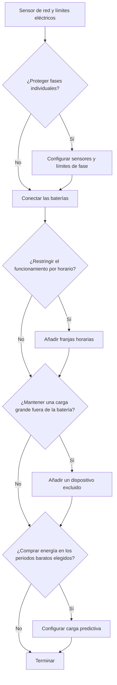

# Configura Omnibattery para tu hogar

Empieza con el contador de red y la conexión de la batería; después añade solo los controles que necesite tu instalación. Este recorrido deja las franjas opcionales, la planificación solar y las reglas para cargas grandes fuera de tu camino hasta que resuelvan un problema real.

## ¿Lo necesito?

**Úsalo si** instalas Omnibattery por primera vez o decides qué secciones opcionales se aplican a tu hogar.

**No lo necesitas si** la integración ya funciona y solo quieres manejar un interruptor, número o selector existente desde el panel de Omnibattery.

## Antes de empezar

- Añade la batería a tu red o prepara los datos de conexión que requiera su controlador.
- Localiza un sensor de Home Assistant que informe de la potencia importada y exportada de red.
- Ten a mano tu límite de potencia contratada.
- Para funciones opcionales, identifica los sensores de previsión solar, producción solar, corriente de fase o cargas grandes que vayas a usar.

## Cómo activarlo

1. Abre **Ajustes → Dispositivos y servicios → Añadir integración**, busca **Omnibattery** y selecciona tu [sensor de red y límites eléctricos](main-sensor.md).
2. Si cada fase necesita su propio límite de corriente, sigue [Protección de corriente trifásica](three-phase.md) antes de continuar. En caso contrario, déjala desactivada.
3. Añade cada batería mediante [Elegir una marca](batteries/index.md) e introduce su conexión y límites de funcionamiento.
4. Sigue el recorrido siguiente para el comportamiento opcional y termina la configuración.

{ width="650" style="display: block; margin: 0 auto;"}

## Qué verás

El dispositivo Omnibattery expone los controles que corresponden a tu configuración guardada. Las franjas horarias y los dispositivos excluidos tienen sus propios interruptores en directo; la protección de fase, el comportamiento de prioridad solar y otras funciones activadas también aparecen como controles. Usa esas entidades para los cambios cotidianos sin volver a abrir la configuración.

Para cambiar el sensor, la conexión de la batería, la definición de una franja o la de un dispositivo, abre **Ajustes → Dispositivos y servicios → Omnibattery → Configurar** y elige la sección correspondiente.

## Si no funciona

| Síntoma | Causa probable | Qué comprobar |
|---|---|---|
| Omnibattery no puede continuar tras el primer formulario | El sensor de red no está disponible o usa una unidad no admitida | Confirma que la entidad existe e informa potencia en `W` o `kW` |
| Falta una sección opcional tras terminar la configuración | Se omitió o no se configuró su sensor necesario | Abre **Configurar** y vuelve a esa sección |
| Un ajuste guardado no aparece en el panel | Es un valor de configuración, no un control en directo, o la entidad está desactivada | Revisa la página del dispositivo Omnibattery y sus entidades desactivadas |
| Un interruptor en directo cambia el comportamiento, pero no el formulario | Los controles en tiempo de ejecución y los campos de configuración tienen finalidades distintas | Usa **Configurar** para las definiciones; usa las entidades del panel para el funcionamiento temporal |

??? "Detalles avanzados"
    El asistente inicial sigue una secuencia para validar dependencias: sensores y protección de fase opcional, baterías, franjas horarias, dispositivos excluidos y, por último, carga predictiva. El menú **Configurar** permite después volver directamente a esas secciones.

    Las ramas opcionales son independientes. Las franjas horarias controlan cuándo se permite una dirección; la carga predictiva decide si comprar energía de red; los dispositivos excluidos cambian qué cargas debe cubrir la batería. Activar una no requiere las demás, salvo que su propia página lo indique.
