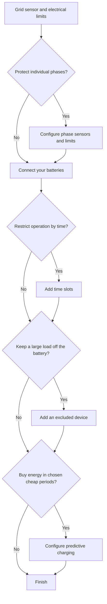

# Configure Omnibattery for your home

Start with the grid meter and battery connection, then add only the controls your installation needs. This route keeps optional schedules, solar planning, and large-load rules out of the way until they solve a real problem for you.

## Do I need it?

**Use it if** you are installing Omnibattery for the first time or deciding which optional setup sections apply to your home.

**You do not need it if** the integration is already working and you only want to operate an existing switch, number, or selector from the Omnibattery dashboard.

## Before you start

- Add the battery to your network or prepare the connection details required by its driver.
- Find a Home Assistant sensor that reports grid import and export power.
- Have your contracted-power limit available.
- For optional features, identify any solar forecast, solar production, phase-current, or large-load sensors you plan to use.

## How to enable it

1. Open **Settings → Devices & services → Add integration**, search for **Omnibattery**, and select your [grid sensor and electrical limits](main-sensor.md).
2. If each phase needs its own current limit, follow [Three-phase current protection](three-phase.md) before continuing. Otherwise, leave it disabled.
3. Add each battery through [Choose a brand](batteries/index.md) and enter its connection and operating limits.
4. Follow the route below for optional behavior, then finish the setup.

{ width="650" style="display: block; margin: 0 auto;"}

## What you will see

The Omnibattery device exposes the controls that match your saved configuration. Time slots and excluded devices get their own live switches; phase protection, solar-priority behavior, and other enabled features also appear as controls. Use those entities for day-to-day changes without reopening setup.

To change the sensor, battery connection, schedule definition, or device definition, open **Settings → Devices & services → Omnibattery → Configure** and choose the relevant section.

## If it does not work

| Symptom | Likely cause | What to check |
|---|---|---|
| Omnibattery cannot continue past the first form | The grid sensor is unavailable or uses an unsupported unit | Confirm that the entity exists and reports power in `W` or `kW` |
| An optional section is missing after setup | It was skipped or its required sensor was not configured | Open **Configure** and revisit that section |
| A saved setting does not appear on the dashboard | It is a setup value rather than a live control, or the entity is disabled | Check the Omnibattery device page and its disabled entities |
| A live switch changes behavior but the setup form does not change | Runtime controls and setup fields serve different purposes | Use **Configure** for definitions; use dashboard entities for temporary operation |

??? "Advanced details"
    The initial wizard follows one sequence so it can validate dependencies: sensors and optional phase protection, batteries, time slots, excluded devices, then predictive charging. The **Configure** menu later lets you revisit those sections directly.

    Optional branches are independent. Time slots control when a direction is permitted; predictive charging decides whether to buy grid energy; excluded devices change which loads the battery should cover. Enabling one does not require the others unless its own page says so.
