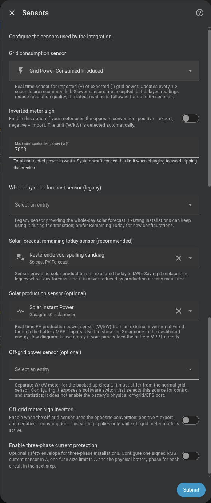

# Connect your grid meter and electrical limits

Omnibattery uses your grid-power sensor to decide how much the batteries should charge or discharge. This setup also defines the electrical ceiling and the optional solar or backup-circuit data used by other features.

## Do I need it?

**Use it if** you are setting up Omnibattery: every installation needs a grid consumption sensor and a maximum contracted power.

**You do not need** the optional solar, backup-output, or three-phase fields unless your installation uses the related feature.

## Before you start

- Find a Home Assistant `sensor` that reports live grid exchange in `W` or `kW`, such as a Shelly EM/EM3, Neurio, or smart-meter integration.
- Check whether positive values mean import and negative values mean export.
- Find your contracted-power limit in watts.
- Optional: prepare a remaining-today solar forecast, external-inverter production sensor, or separate backup-circuit meter.

## How to enable it

1. Open **Settings → Devices & services → Omnibattery → Configure → Sensors** and select **Grid consumption sensor**.
2. Import power should be positive. If your meter reports import as negative, enable **Inverted meter sign**.
3. Enter **Maximum contracted power (W)** so battery charging cannot push projected grid import above that ceiling.
4. Add only the optional sources you need: **Solar forecast remaining today sensor (recommended)** for solar planning, **Solar production sensor (optional)** for an external inverter, or **Off-grid power sensor (optional)** for a separately metered backup circuit.
5. Enable **Three-phase current protection** only when you can provide signed current sensors and limits for the physical phases you want to protect.

{ width="600" style="display: block; margin: 0 auto;"}

!!! warning "Screenshot needs updating"
    The current form also includes separate remaining-today forecast, off-grid meter, and three-phase protection fields that are not visible in this screenshot.

## What you will see

The dashboard energy-flow diagram uses the grid sensor and available battery and solar data. Omnibattery also creates **Home Consumption** by combining those sources; you do not select a separate household-consumption sensor.

Configuring a backup-circuit meter creates **Off-grid Meter Mode**. Turn it on to use that meter for control and grid statistics, and turn it off to return to the main meter. This software switch does not enable the battery's physical backup output (EPS).

A remaining-today solar forecast becomes available to predictive charging and solar charge delay. External solar production adds the Solar node to the energy-flow diagram when the panels are connected to a separate inverter.

## If it does not work

| Symptom | Likely cause | What to check |
|---|---|---|
| The battery moves grid power away from the target | The meter sign is reversed | Import a small amount from the grid and confirm that the sensor is positive; otherwise enable **Inverted meter sign** |
| Control reacts late or overshoots changing loads | The grid sensor publishes too slowly | Check the entity history and shorten its update interval where the meter supports it |
| **Off-grid Meter Mode** is missing | No separate backup-circuit meter was saved | Configure **Off-grid power sensor (optional)** and make sure it differs from the main sensor |
| The Solar node is missing | Omnibattery has no external solar-production source | Configure **Solar production sensor (optional)** only for solar that is not measured through battery maximum power point tracking (MPPT) inputs |
| Predictive charging ignores the forecast | A whole-day value was selected as remaining energy, or the sensor unit is wrong | Prefer the remaining-today forecast and confirm it reports `Wh` or `kWh` |
| **Home Consumption** briefly holds or becomes `unknown` during a direction change | Grid, battery, and solar readings describe different instants | Check that the sources update promptly and then wait for coherent readings |

??? "Advanced details"
    **Meter cadence and stale data**

    The controller recalculates whenever the grid sensor publishes. A safety cycle also runs every 2 seconds. An update interval of 1–2 seconds is recommended; intervals of 10 seconds or more trigger a Home Assistant Repair after 3 consecutive slow reports. The Repair clears after 20 consecutive faster intervals. The latest reading remains authoritative until it is more than 65 seconds old.

    Household demand can change by several kilowatts between slow readings, so the controller may otherwise respond to a load that has already changed.

    If you use a Shelly meter, see the [Shelly Pro 3EM MQTT scripts](../hardware/shelly-pro-3em-mqtt-script.md) for a faster publication cadence.

    Sensors with `unit_of_measurement: kW` are converted to watts automatically.

    **Contracted-power protection**

    The setup value defaults to 7,000 W and accepts 1,000–20,000 W. It caps battery charging in normal control, positive targets, hourly net balance, and predictive grid charging. During a predictive charging slot, Omnibattery first stops charging if import reaches the ceiling; after telemetry settles, it may discharge the confirmed excess. [Capacity protection (peak shaving)](../features/peak-shaving.md) is a separate reserve strategy.

    **Solar sources**

    A remaining-today forecast is already future energy, so Omnibattery does not subtract measured production from it. The legacy whole-day field remains available for existing entries; saving a remaining-today sensor replaces it. The real-time external production sensor and readable battery MPPT channels help learn the production shape, but do not replace the forecast total.

    When dated provider periods are available, Omnibattery uses them for the solar timeline. Otherwise it uses a mature local profile and then a sinusoidal fallback. The profile does not predict total energy or correct the weather provider.

    **Derived home consumption**

    ```text
    home consumption = grid power + battery alternating current (AC) power + solar power
    ```

    The value feeds a 7-day consumption history used by predictive charging and solar charge delay. It accumulates over the local day, resets at midnight, and survives Home Assistant restarts. Battery charging power cancels the grid energy used to charge it.

    Because the sources update independently, a direction change can briefly create an impossible balance. **Home Consumption** keeps its last coherent value for up to 15 seconds, then reports `unknown` if the inputs still disagree. Its physical daily-energy accumulator breaks that interval instead of adding a false zero. External-load exclusions used for control do not alter this physical dashboard total.

    Selecting **Off-grid Meter Mode** breaks the current energy-integration interval so a jump between meters is not counted as energy. The off-grid sign setting applies only to that source. Batteries powering their own backup output remain outside proportional–derivative (PD) control while the other available batteries use the selected meter.
