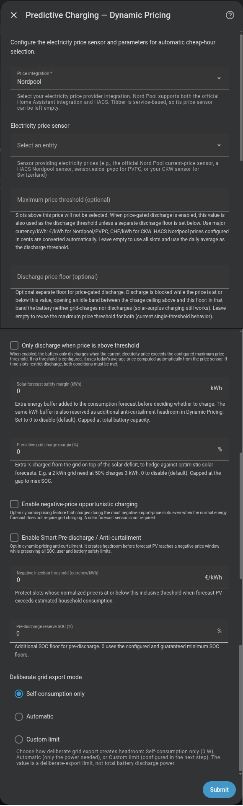

# Carga predictiva con precios futuros

Precio dinámico lee un calendario de precios futuros y compra el déficit energético calculado en los periodos más baratos que aún pueden entregarlo a tiempo. También puede proteger la energía almacenada, gestionar la exportación solar y vender energía seleccionada durante periodos caros.

## ¿Lo necesito?

**Úsalo si…** tu proveedor publica precios por intervalos para hoy y el futuro y quieres que Omnibattery elija cuándo cargar.

**No lo necesitas si…** tu tarifa tiene periodos baratos fijos que se repiten; usa [Franja horaria](time-slot.md). Si tu fuente solo expone el precio vigente ahora, usa [Precio en tiempo real](real-time-price.md).

## Antes de empezar

- Configura una fuente compatible: **Nordpool**, **PVPC**, **CKW**, **EPEX Spot**, **ENTSO-e**, **Zonneplan** o **Tibber**.
- Selecciona la entidad de precio actual del proveedor salvo que uses Tibber. Tibber usa el servicio `tibber.get_prices` de la integración oficial y no necesita sensor de precio.
- La previsión solar es opcional. Una previsión de energía restante mejora la replanificación diurna y evita contar la solar ya producida. **Venta a precio alto** en *Solo excedente* o superior necesita que la integración de previsión configurada proporcione previsiones al panel de Energía de Home Assistant, como Solcast o Forecast.Solar.
- Decide si necesitas una fuente de precio de exportación. Es opcional y la usan **Retención de excedente por precio** y **Venta a precio alto**; déjala vacía cuando la exportación se remunere al precio de importación.

## Cómo activarlo

1. Abre **Ajustes → Dispositivos y servicios → Omnibattery → Configurar** y elige **Precio dinámico** como modo de carga predictiva.
2. Selecciona **Tipo de integración de precios** y después **Sensor de precio de electricidad**. Deja el sensor vacío para Tibber.
3. Selecciona una previsión solar opcional y, si hace falta, un sensor de precio de exportación/inyección y su tipo de integración.
4. Termina el formulario y confirma que **Carga predictiva** está activada en la pestaña **Control** de Omnibattery.
5. Deja desactivados los controles de precio opcionales hasta que el horario básico se comporte como esperas; activa solo la política que corresponda a tu objetivo.

{ width="650" style="display: block; margin: 0 auto;" }

!!! note "Elección de sensor específica del proveedor"
    Para Zonneplan, elige **Current quarter hourly electricity tariff** para un contrato de cuarto de hora o **Current hourly electricity tariff** para un contrato horario. También se admite el antiguo **Current electricity tariff**. Para Nord Pool, elige una entidad de la integración oficial o el sensor de HACS; Omnibattery detecta el formato.

## Qué verás

**Carga predictiva activa** muestra si se necesita carga, los periodos seleccionados, sus cuotas de energía y cualquier déficit no cubierto. Omnibattery elige el periodo elegible más barato que ocurre antes de cada necesidad proyectada, por lo que puede omitir el periodo más barato absoluto si llega demasiado tarde.

Un calendario visible puede ser informativo. Cuando la energía almacenada y la solar prevista ya cubren la demanda, `selected_hours` puede seguir mostrando periodos baratos útiles mientras `charging_needed` permanece en falso. Alcanzar un objetivo de carga desde red también deja disponible la carga con excedente solar; no bloquea la batería frente a la solar posterior.

El plan se reconstruye cuando nueva información cambia el horizonte restante: antes de periodos seleccionados, al final del día solar, tras una caída importante de SOC, tras una revisión importante de previsión solar, cuando llegan los precios de mañana, cuando cambia un ajuste relevante o cuando una carga grande excluida cambia cuánta solar prevista queda para la batería. Pulsa **Reevaluar carga predictiva** para reconstruirlo inmediatamente.

Los controles opcionales de la pestaña **Control** resuelven problemas distintos:

| Objetivo | Control | Resultado |
|---|---|---|
| Llenar el espacio disponible de batería cuando los precios de importación son negativos | **Carga oportunista con precio negativo** | Añade periodos con precio negativo que cumplan la condición incluso sin un déficit energético normal |
| Conservar energía de batería mientras el precio actual es barato | **Descarga basada en precio** | Bloquea la descarga ordinaria hasta que el precio supera su umbral activo |
| Evitar perder solar cuando se penaliza la exportación | **Predescarga inteligente / Antilimitación de producción** | Crea espacio de batería antes de periodos de riesgo solar previsto |
| Exportar solar ahora y absorberla después cuando el valor de inyección es inferior | **Retención de excedente por precio** | Pausa la carga por excedente fuera de los periodos seleccionados de menor precio de exportación |
| Guardar energía almacenada para periodos de demanda doméstica más caros | **Reserva de descarga** | Eleva un suelo económico de descarga para la futura demanda cara |
| Exigir un diferencial de compra/venta que merezca la pena | **Margen mínimo de arbitraje** | Rechaza operaciones de carga o exportación cuyo diferencial no cubra pérdidas y el margen seleccionado |
| Vender energía que la solar de mañana puede reponer durante un pico de precio que cumpla la condición | **Venta a precio alto** → *Solo excedente* | Exporta energía de batería que la solar prevista de mañana puede reponer tras cubrir la vivienda hasta el amanecer |
| Vender también energía que la vivienda necesitará después y recomprarla | **Venta a precio alto** → *Excedente + arbitraje* | Exporta energía solo cuando sigue ahorrando dinero al reponer después la demanda de la vivienda que deja de cubrir |

## Si no funciona

| Síntoma | Causa probable | Qué comprobar |
|---|---|---|
| No aparece ningún horario | Los precios futuros no están disponibles o se eligió la entidad de proveedor incorrecta | `price_data_status`, integración del proveedor y atributos del sensor de precio |
| Aparecen periodos baratos pero no empieza la carga | El calendario es informativo, no queda déficit o ya se cumplió la cuota por periodo | `charging_needed`, `slot_energy_targets_kwh` y SOC objetivo de batería |
| Se omitió el periodo más barato | Ocurre después del plazo energético, supera el techo de precio o no cumple el margen de arbitraje | `energy_deadlines`, controles de precio activos y `total_shortfall_kwh` |
| El horario informa de un déficit no cubierto | Los periodos elegibles no pueden suministrar suficiente energía antes de necesitarla | Techo de precio, potencia de carga, capacidad de batería y límites de fase y potencia contratada |
| Faltan periodos más baratos de mañana | El proveedor aún no los ha publicado o se permite que termine el periodo activo antes de replanificar | Datos del proveedor y **Reevaluar carga predictiva** tras su publicación |
| Una función de precio está activada pero inactiva | No están disponibles su previsión, perfil, precio de exportación, capacidad de batería o lectura de red requeridos | Sensor binario de estado de la función y atributo de motivo |
| El excedente solar se exporta inesperadamente | **Retención de excedente por precio** seleccionó un periodo posterior de absorción más barato | **Estado de retención de excedente por precio** y su próxima hora de liberación |
| La batería no descarga | **Descarga basada en precio**, **Reserva de descarga**, franjas horarias de funcionamiento u otro bloqueo de descarga están activos | **Estado de integración**, sensores de estado de funciones y [franjas horarias de funcionamiento](../time-slots.md) |
| **Venta a precio alto** en *Solo excedente* no vende | La previsión solar de mañana no puede rellenar la batería, la integración de previsión no proporciona previsiones al panel de Energía o no existe un periodo de exportación rentable | **Estado de venta a precio alto**, su atributo de motivo, la previsión solar de mañana y los precios de exportación |

??? "Detalles avanzados"
    ### Normalización de fuentes de precio

    Omnibattery admite **Nordpool**, **PVPC**, **CKW**, **EPEX Spot**, **ENTSO-e**, **Zonneplan** y **Tibber**. Los analizadores de proveedores normalizan los periodos de precios fechados al mismo horario local.

    Zonneplan lee el atributo `forecast` del sensor elegido, incluido mañana cuando está disponible. Los importes de previsión se dividen por 10.000.000 para obtener moneda principal/kWh con impuestos incluidos; el estado actual del sensor ya está en moneda principal/kWh. Se conservan los precios negativos y cero. Las entradas modernas conservan límites de periodo explícitos; las entradas heredadas usan periodos de una hora.

    Una entidad Nord Pool de HACS se lee desde `raw_today` y `raw_tomorrow`. Si `price_in_cents` es verdadero, Omnibattery convierte el calendario y el precio en vivo a moneda principal/kWh. Para una entidad oficial de Nord Pool, resuelve el área de mercado, llama a `nordpool.get_prices_for_date`, convierte moneda/MWh a moneda/kWh y actualiza la caché cada hora.

    Tibber llama a `tibber.get_prices`, almacena en caché los precios de hoy y los de mañana una vez publicados y actualiza la caché cada hora. La integración oficial de Tibber debe estar ya configurada.

    El planificador usa horas locales de reloj. Durante la transición de horario de verano (DST) de otoño, los periodos locales repetidos no pueden representarse por separado; se omite un periodo cuyo final local precede al inicio. Revisa el horario los días de cambio de hora.

    ### Plan cronológico diario

    A las 00:05 locales, Omnibattery:

    1. Proyecta consumo de la vivienda, solar y energía utilizable de batería en intervalos de 15 minutos hasta el próximo amanecer local. El amanecer se limita a 00:00–12:00; si no puede calcularse, el horizonte termina a medianoche.
    2. Obtiene los periodos de precio disponibles hasta ese horizonte.
    3. Detecta cuándo la energía acumulada alcanzaría el SOC mínimo y reserva los periodos elegibles más baratos que pueden entregar cada requisito antes de su plazo.
    4. Calcula el precio medio diario sobre el horizonte disponible.
    5. Asigna a cada periodo seleccionado una cuota de energía; solo la energía sin un plazo anterior se optimiza libremente por precio.

    «Más barato» significa más barato entre los periodos que pueden cumplir el requisito a tiempo. La proyección limita la energía almacenada a la capacidad utilizable de la flota, por lo que la solar que no cabe no se arrastra como energía ficticia. Un plan parcial sigue siendo ejecutable, pero registra si el filtro de precio o la capacidad física de los periodos causó los kWh no cubiertos.

    Solo la solar restante de hoy entra en el horizonte de control. La demanda doméstica posterior a medianoche se incluye hasta el amanecer, cuando puede empezar la producción de mañana. **Margen de seguridad de previsión solar** se resta una vez de esa previsión. Las instalaciones nuevas comienzan con aproximadamente el 5% de la capacidad de flota configurada; si la capacidad no está disponible durante la configuración, el método alternativo es no aplicar margen. Es un control en vivo, no un campo de formulario.

    Si faltan precios a las 00:05, la evaluación se reintenta a intervalos de 15 minutos durante la primera hora, hasta cuatro reintentos. Si Home Assistant arranca después de la evaluación diaria y no existe plan, reconstruye el horizonte restante tras un retraso de arranque de 15 segundos.

    ### Reevaluación automática

    El plan diario puede reconstruirse mediante estos eventos:

    - **Antes de un periodo seleccionado:** una hora antes de un futuro periodo seleccionado, Omnibattery comprueba el balance restante. Elimina silenciosamente el periodo si ahora basta la energía o lo confirma mediante notificación si persiste el déficit. Los periodos consecutivos no se reconsideran mientras el anterior está cargando.
    - **Evaluación de final del día:** cuando se ha detectado el inicio solar, se ejecuta aproximadamente 1,5 horas antes del final de producción estimado; en caso contrario usa las 16:00. Añade futuros periodos elegibles solo para un déficit restante de al menos 0,3 kWh. Esta recarga de seguridad no se rechaza por la puerta opcional del margen de arbitraje.
    - **Caída de SOC:** un plan cronológico se reconstruye tras una caída de cinco puntos porcentuales desde la última media de flota evaluada. Un plan alternativo no cronológico conserva el umbral de 30 puntos. Una subida de SOC no lo activa.
    - **Revisión de previsión solar:** un cambio de al menos 1,5 kWh en cualquier dirección reconstruye el plan, con un periodo de espera de 30 minutos y un máximo de cuatro reconstrucciones al día. La solar medida desde la lectura guardada se elimina antes de comparar, y un sensor no disponible no se trata como una previsión desplomada.
    - **Reclamación solar de dispositivo excluido:** un cambio importante en una carga excluida, como una sesión de vehículo eléctrico, reconstruye el plan porque ese dispositivo cambia cuánta solar prevista queda para la batería.
    - **Precios de mañana:** los precios recién publicados reconstruyen el horizonte restante una vez al día. Si hay un periodo de carga seleccionado en curso, la reconstrucción espera hasta que termine.
    - **Ajustes relevantes:** los cambios de SOC mínimo/máximo de batería, **Margen de seguridad de previsión solar** o **SOC mínimo garantizado** reconstruyen el plan en el siguiente ciclo de control.

    Las referencias diarias se reinician a medianoche. Las protecciones en ejecución, control manual, estado de respaldo, permisos de franjas horarias, disponibilidad de batería y límites de SOC siguen siendo autoritativos durante cada reconstrucción.

    **Reevaluar carga predictiva** reconstruye inmediatamente el horizonte restante de Precio dinámico. No crea un plan de varios días: una reconstrucción de tarde cubre el periodo restante hasta el próximo amanecer, mientras que el siguiente plan diario normal se construye a las 00:05.

    ### Carga oportunista con precio negativo

    Esta función opcional selecciona independientemente periodos de importación horarios o de cuarto de hora cuyo precio normalizado sea inferior a cero. Calcula la energía de batería necesaria para alcanzar el SOC máximo configurado de cada batería y toma primero los periodos más negativos. No se requiere previsión solar.

    Cada periodo seleccionado registra `deficit`, `negative_price` o `combined` como su propósito. Un periodo de déficit con precio positivo conserva el objetivo normal de déficit. En un periodo combinado, se aplica el mayor de los objetivos de déficit y oportunidad. La carga se detiene en el SOC máximo configurado de cada batería y se eliminan los periodos solo de oportunidad no usados.

    Durante una ventana de riesgo de limitación de producción, la carga oportunista solo puede usar el espacio de batería que queda después de reservar espacio para la solar esperada:

    ```text
    opportunistic space = current free space − remaining solar reserve
    ```

    Un requisito de SOC mínimo garantizado es la excepción de seguridad. La falta de datos solares hace que la antilimitación de producción falle de forma segura, pero no cancela una oportunidad válida de precio de importación negativo. Potencia contratada, límites de batería, control manual, estado de respaldo, disponibilidad y demás bloqueos de seguridad siguen aplicándose.

    ### Predescarga inteligente / Antilimitación de producción

    Esta función opcional no controla un inversor solar. Encuentra periodos donde el precio de importación es igual o inferior a **Umbral de inyección negativa** y el excedente solar previsto supera el consumo de la vivienda. Antes del primer periodo de riesgo, selecciona los periodos elegibles de mayor valor para predescargar hasta que exista suficiente espacio de batería, sujeto a suelos de SOC, reservas, límites de potencia y bloqueos.

    El umbral de inyección negativa predeterminado es 0 moneda/kWh. **SOC de reserva de predescarga** añade un suelo; su valor predeterminado es 20%, mientras que un valor de 0 usa los suelos existentes de las baterías. Los periodos de riesgo se agrupan en bloques de aproximadamente una hora para reducir cambios repetidos.

    El comportamiento de exportación puede ser **Solo autoconsumo**, **Automático** o **Límite personalizado**:

    - **Solo autoconsumo** no permite exportación deliberada a red y equivale a 0 W.
    - **Automático** exporta solo la potencia necesaria para crear el espacio calculado.
    - **Límite personalizado** limita la exportación deliberada a red al valor configurado en W; no limita la descarga total de batería usada por la vivienda.

    Durante un periodo de riesgo, el objetivo neto de red se limita a cero para que la batería pueda cubrir el consumo de la vivienda sin exportación deliberada. Siguen prevaleciendo SOC mínimo y mínimo garantizado, franjas horarias de funcionamiento, control manual, estado de respaldo, baterías no disponibles y protección de capacidad. La falta de precios, previsión, SOC, capacidad o datos de red elimina la anulación y el bloqueo.

    `curtailment_status` informa de estado, motivo, siguiente periodo de riesgo, espacio necesario/actual, descarga planificada, déficit no cubierto, objetivos de batería, periodos seleccionados y objetivo de exportación activo. Los atributos para automatización incluyen `protected_window_active`, `headroom_deficit_kwh`, `inverter_curtailment_required`, `charge_limit_reason` y `charge_limit_reasons`. Los diagnósticos también exponen `solar_reserve_remaining_kwh`, `current_free_space_kwh` y `opportunistic_space_available_kwh`.

    `active_export_target_w` es el objetivo de la batería, no una orden universal para un inversor solar. Una automatización de inversor debe aplicar y después restaurar su propio límite.

    ### Retención de excedente por precio

    Esta función opcional decide cuándo absorber excedente solar bajo una tarifa de exportación dinámica. Estima el objetivo diario de energía restante de la batería, distribuye solar y consumo esperados entre futuros periodos de precio y selecciona los periodos de menor precio de exportación que pueden absorber ese objetivo. Un periodo de precio bajo sin excedente disponible no se selecciona solo por ser barato.

    Fuera de los periodos seleccionados añade el bloqueo de carga `surplus_price_hold`. La carga de batería se limita a 0 W y el excedente se exporta, mientras que la descarga de batería para autoconsumo sigue disponible.

    La retención se libera en un periodo de absorción seleccionado, tras el plazo solar, una vez alcanzado el objetivo, cuando los periodos restantes no pueden cubrir el objetivo o cuando el mejor ahorro restante es inferior a **Ahorro mínimo de retención de excedente**. Ese control tiene por defecto 0,02 moneda/kWh. El objetivo sigue el SOC en vivo en cada ciclo, y el plan se reconstruye cada cinco minutos y durante las reconstrucciones normales de Precio dinámico.

    La falta de precios, previsión, SOC/capacidad utilizable o entradas finitas libera la retención. El retraso de carga, un periodo activo de carga desde red, carga con precio negativo, antilimitación de producción, carga completa semanal, protección de picos, pausa de vehículo eléctrico, control manual, control de franjas horarias y una batería en su suelo de SOC también la liberan.

    **Sensor de precio de exportación/inyección** es opcional. Cuando falta, se reutiliza la curva de importación. Tibber no puede suministrar la curva de exportación porque su caché de servicio pertenece a la fuente de importación. Un sensor de exportación fallido no plantea el problema de reparación del precio de importación.

    **Estado de retención de excedente por precio** informa de estado, motivo, objetivo diario, capacidad de absorción restante, plazo, próxima liberación, periodos seleccionados y sus precios, y la fuente de curva. **Estado de integración** informa de `surplus_price_hold` mientras está activa.

    ### Descarga basada en precio y umbral de descarga separado

    **Descarga basada en precio** comprueba el precio actual en cada ciclo de control. Si está por encima de su umbral, se permite la descarga PD normal; en o por debajo del umbral, la descarga se bloquea y se congela el estado del controlador.

    Precio dinámico usa **Umbral máximo de precio** cuando está configurado; de lo contrario usa la media diaria calculada sobre el horizonte de planificación actual. Si no existe ninguno, este bloqueo no actúa. El umbral máximo también impide la carga desde red a precios superiores.

    **Umbral de precio de descarga** puede abrir una banda de precio inactiva. Debe estar en o por encima del techo de carga:

    ```text
    price ≥ discharge threshold                   → discharge allowed
    charge ceiling < price < discharge threshold → neither grid charge nor discharge
    price ≤ charge ceiling                        → discharge blocked; cheap grid charge may run
    ```

    Deja vacío el umbral de descarga separado para usar el umbral máximo de precio en ambas decisiones. La carga por excedente solar sigue disponible en la banda inactiva. Las franjas horarias de funcionamiento y el permiso de precio deben permitir ambos la descarga; consulta [franjas horarias de funcionamiento](../time-slots.md).

    ### Reserva de descarga

    Esta función opcional guarda energía almacenada para periodos de demanda doméstica más caros antes del próximo amanecer. Proyecta el perfil aprendido de demanda de 15 minutos y la solar esperada, permite que los periodos más caros reclamen solo la energía necesaria y reserva reclamaciones que superan el precio actual en **Ahorro mínimo de reserva de descarga**. Ese control tiene por defecto 0,05 moneda/kWh.

    El excedente solar esperado puede liberar parte de la reserva, pero solo cuando cabe físicamente en la batería. El excedente que **Retención de excedente por precio** planea exportar no recibe crédito. El planificador acredita el 75% del excedente esperado que cumple la condición para que la incertidumbre de previsión no libere toda la reserva antes de que llegue producción real.

    La energía resultante se convierte en un suelo adicional de SOC de flota. La energía por encima sigue disponible ahora y el suelo cae cuando el periodo actual se vuelve caro. El `min_soc` configurado de batería no se reescribe. La protección de picos, emergencia y antilimitación de producción pueden ignorar este bloqueo económico.

    La reserva termina en el próximo amanecer. La falta de precios, perfil de consumo, energía utilizable o demanda futura la deja en el SOC mínimo configurado. Control manual, antilimitación de producción, protección de picos, control de franjas horarias y una anulación explícita de SOC por periodo también la liberan.

    **Estado de reserva de descarga** informa de estado activo, motivo, energía/porcentaje reservado, precio de referencia, reclamaciones, crédito solar esperado, demanda de horizonte y excedente de horizonte. **Estado de integración** informa de `price_reserve_hold` mientras una batería está retenida.

    ### Margen mínimo de arbitraje y eficiencia de ciclo completo

    El **Margen mínimo de arbitraje** opcional rechaza un periodo de carga salvo que el valor esperado de descarga futura cubra las pérdidas de conversión y el margen seleccionado:

    ```text
    expected_discharge_price × round_trip_efficiency − charge_price ≥ margin
    ```

    El margen se desactiva cuando está vacío o se establece en 0. Se aplica además de **Umbral máximo de precio**, y prevalece el techo más estricto. Filtra la selección comercial de las 00:05; las reconstrucciones posteriores de horizonte restante y seguridad de final del día aún pueden programar la energía necesaria para evitar un déficit.

    **Eficiencia de ciclo completo** tiene por defecto 0,85 y representa la eficiencia marginal de energía de CA a CA. Valores inferiores requieren un diferencial bruto mayor. Es distinta de los totales vitalicios de carga/descarga, que incluyen el consumo en reposo.

    El mismo margen mínimo se aplica a **Venta a precio alto**, de manera que las decisiones de compra y venta usan una sola preferencia de riesgo económico.

    ### Venta a precio alto

    Un selector, desactivado por defecto y disponible solo con **Precio dinámico**, fija cuánta energía almacenada se puede vender en periodos de exportación caros. Cada nivel incluye el anterior:

    - **Desactivada**: no se vende nada.
    - **Solo excedente**: vende la energía que la vivienda no necesitará antes del amanecer y que la solar de mañana puede reponer. Nunca te hace comprar de la red.
    - **Excedente + arbitraje**: vende también energía que la vivienda necesitará después y la recompra de la red cuando sale más barato.

    #### Excedente + arbitraje

    Este nivel vende además energía almacenada en un periodo caro que cumple la condición solo cuando sigue ahorrando dinero tras comprar de la red la demanda de la vivienda que esa energía habría cubierto. La energía sin demanda doméstica posterior no se vende y la exportación nunca cruza el suelo de SOC de una batería.

    Cuando la previsión indica que la batería se agotará antes del amanecer y **Reserva de descarga** está desactivada, Omnibattery compara el precio de exportación con los últimos periodos de demanda de la vivienda que se comprarían de la red por la venta. Empieza por el último periodo antes del amanecer y se detiene en la primera venta que no compensaría. Por ejemplo, si la batería iba a durar hasta las 05:00, vender a las 18:00 hace que se agote algo antes, hacia las 04:00. Lo que se vuelve a comprar es la demanda de 04:00 a 05:00, así que la venta se compara con ese precio, no con el periodo caro de las 20:00, que la batería sigue cubriendo.

    Si la previsión indica que la batería durará hasta el amanecer, o **Reserva de descarga** está activada, se mantiene la regla conservadora: el precio de exportación debe superar el precio de importación posterior más alto, más el **Margen mínimo de arbitraje**. El periodo de exportación que cumple la condición y tiene el precio más alto recibe primero energía. La exportación deliberada neta a red usa el límite efectivo de descarga de la flota; no existe un control separado de límite de exportación con precio alto.

    #### Solo excedente

    Este nivel vende energía de batería que la vivienda no necesitará antes del amanecer de mañana, pero solo cuando la solar prevista para mañana puede reponerla.

    Su presupuesto de exportación parte de la energía utilizable de batería y reserva después lo necesario para el consumo previsto de la vivienda hasta el amanecer y el **Margen de seguridad de previsión solar**. El coste de vender es el ingreso de exportación que se deja de percibir mañana mientras la solar rellena la batería, no el precio pagado originalmente para cargarla. Solo vende cuando el precio de exportación actual es superior al precio de exportación más alto previsto durante la recarga de mañana, ajustado por la **Eficiencia de ciclo completo** y el **Margen mínimo de arbitraje**.

    Con una tarifa de inyección plana nunca vende: vender ahora y recargar después solo perdería energía en el ciclo de batería. También permanece inactiva cuando la previsión solar de mañana no puede rellenar la batería. Usa la previsión de mañana de la integración solar ya configurada en Omnibattery; no hace falta configurar otro sensor, pero esa integración debe proporcionar previsiones al panel de Energía de Home Assistant.

    El plan se reconstruye cada cinco minutos y la retirada se comprueba en cada ciclo de control. Cobertura de precio ausente, un periodo caducado, antilimitación de producción, protección de capacidad, carga completa semanal, un periodo activo de carga desde red, control manual, control de franjas horarias, un contador de red no válido o cualquier bloqueo de descarga detienen ambas políticas de exportación. Bajar el selector elimina la política retirada en el siguiente ciclo de control.

    **Estado de venta a precio alto** informa de estado, motivo, potencia objetivo, demanda posterior protegida, energía utilizable, energía asignada y asignaciones por periodo con sus umbrales. Sus diagnósticos de exportación de excedente incluyen `trigger_1_budget_kwh`, `refill_price`, `trigger_1_reason`, `surplus_export_enabled` y `surplus_kwh` para cada periodo.

    ### Atributos de diagnóstico

    El sensor binario `predictive_charging_active` expone:

    | Atributo | Significado |
    |---|---|
    | `charging_needed` | Si el balance restante requiere carga desde red |
    | `selected_hours` | Periodos y precios seleccionados; pueden ser informativos cuando no hace falta carga |
    | `average_price` | Precio medio sobre el perfil evaluado |
    | `estimated_cost` | Coste de carga estimado |
    | `evaluation_timestamp` | Hora de la última evaluación |
    | `price_data_status` | Resultado de fuente de precio como `ok (N slots)`, `sensor_unavailable`, `no_slots` o `not_evaluated` |
    | `chronological_planning_active` | Si la planificación consciente de plazos produjo el horario |
    | `chronological_source` / `solar_timeline_source` | Fuentes de tiempo de demanda de la vivienda y solar |
    | `earliest_projected_depletion` | Primer cruce de SOC mínimo proyectado sin carga desde red |
    | `deadline_required_kwh` / `flexible_required_kwh` | Energía vinculada a plazos y energía optimizada libremente por precio |
    | `deadline_shortfall_kwh` / `total_shortfall_kwh` | Energía urgente y total que los periodos elegibles no pueden entregar |
    | `energy_deadlines` | Requisitos acumulados y plazos ISO locales |
    | `slot_energy_targets_kwh` / `slot_deadlines` | Cuotas y plazos por periodo |
    | `energy_horizon_end` | Límite del próximo amanecer o medianoche si no puede calcularse |
    | `overnight_consumption_kwh` | Demanda doméstica prevista posterior a medianoche hasta el límite |

    Las notificaciones usan el mismo límite de planificación y muestran la demanda nocturna por separado. La cronología solar fechada prefiere periodos del proveedor, después un perfil solar local maduro y después una curva de luz diurna sinusoidal; una fuente no válida pasa atómicamente a la siguiente.
