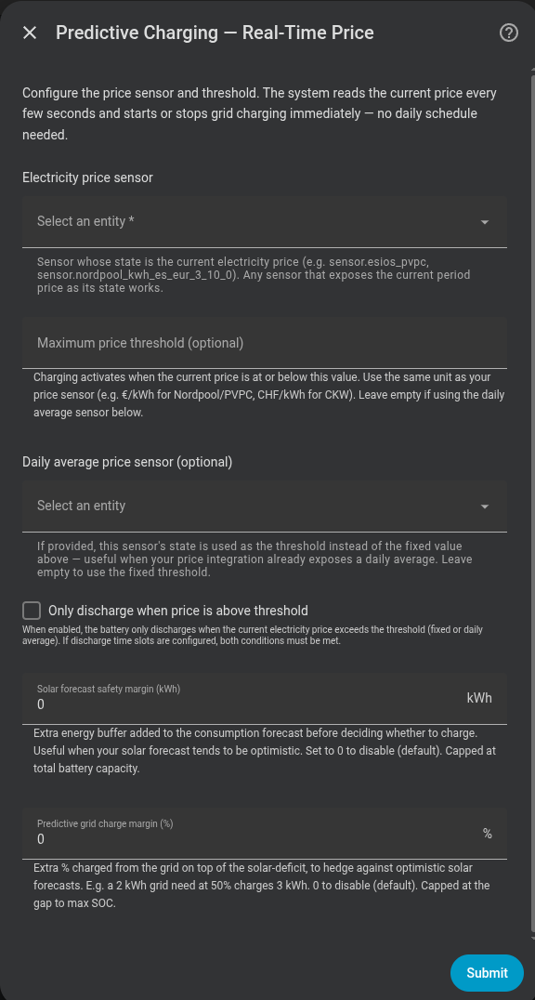

# Predictive charging from the current price

Real-Time Price mode checks the price in effect now and grid-charges when that price is cheap enough and the home has a forecast energy deficit. It makes no promise about future periods because it has no future price calendar.

## Do I need it?

**Use it if** your source exposes only the current electricity price, or you want a direct “charge below this price” rule.

**You do not need it if** your provider publishes future prices and you want the cheapest periods selected in advance; use [Dynamic Pricing](dynamic-pricing.md). For fixed weekly cheap periods, use [Time Slot](time-slot.md).

## Before you start

- Prepare a Home Assistant sensor for the current electricity price.
- Choose either a fixed **Max Price Threshold** or an optional daily-average price sensor. The average sensor takes priority when it has a valid value.
- A solar forecast is optional. Without one, Omnibattery evaluates conservatively with no future solar.
- Configure the common requirements described in [Which mode should I choose?](index.md).

## How to enable it

1. Open **Settings → Devices & services → Omnibattery → Configure** and choose **Real-Time Price** as the predictive charging mode.
2. Select **Electricity price sensor** and, if available, **Daily average price sensor**.
3. Select an optional solar forecast sensor and finish the form.
4. In the Omnibattery **Control** tab, set **Max Price Threshold** if you did not provide an average sensor, then confirm **Predictive Charging** is on.

{ width="650" style="display: block; margin: 0 auto;" }

## What you will see

When the current price is at or below the active threshold, Omnibattery checks the remaining energy balance. It starts grid charging only when battery energy and expected solar do not cover expected household demand. Charging stops when price rises above the threshold, the calculated target is met, or a charging permission or safety rule blocks it.

This mode does not reserve a cheaper future period, assign future price quotas, or expose **Re-evaluate Predictive Charging**. It checks again on every control cycle. Configured [operating time slots](../time-slots.md) can still restrict when charging is allowed.

Turn on **Price-Based Discharge** if you also want to preserve the battery while electricity is cheap. Discharge is blocked at or below the same active threshold and resumes above it, subject to operating-time and safety rules. Solar-surplus charging remains available.

## If it does not work

| Symptom | Likely cause | What to check |
|---|---|---|
| Charging never starts at a cheap price | No valid threshold exists or no energy deficit remains | Current-price sensor, average sensor, **Max Price Threshold**, and **Predictive Charging Active** |
| Charging stops immediately | The current price rose, an operating time slot ended, or a safety/control rule intervened | Live price, charge permissions, SOC target, and **Integration Status** |
| A cheaper period later is ignored | This mode has no future price calendar | Switch to [Dynamic Pricing](dynamic-pricing.md) if future prices are available |
| The battery will not discharge | **Price-Based Discharge** or an operating time slot blocks discharge | Active threshold, live price, and [operating time slots](../time-slots.md) |
| The average sensor appears to be ignored | Its state is unavailable or not numeric | Sensor state and unit; the fixed threshold is used as fallback |
| Forecast energy changes but charging does not start early | The current price is above threshold | Wait for price to qualify; this mode cannot reserve a future period |

??? "Advanced details"
    ### Charging rule and threshold priority

    Every control cycle applies this rule:

    ```text
    if current_price ≤ active_threshold:
        if usable_battery + expected_solar < expected_consumption:
            start or continue grid charging
    else:
        stop grid charging
    ```

    The active threshold is resolved in this order:

    1. A valid **Daily average price sensor**, when configured.
    2. **Max Price Threshold**, the live number entity.

    If neither produces a value, Real-Time Price takes no charging action. If the live price becomes unavailable during a charge, charging stops and undelivered energy is recorded as a shortfall.

    The energy target is still predictive: Omnibattery calculates the current-horizon deficit and a per-battery target. What remains reactive is period selection. A current-price sensor cannot prove that a future period will exist or reach an energy deadline, so this mode creates no future reservations.

    **Solar Forecast Safety Margin** is subtracted from expected solar. New installations start at approximately 5% of total configured battery capacity; if capacity is unknown during setup, the fallback is no margin. It is a live control entity rather than a setup-form field.

    ### Price-Based Discharge

    The optional discharge rule is the inverse of charging:

    ```text
    if current_price > active_threshold:
        discharge allowed
    else:
        discharge blocked
    ```

    When blocked, battery power returns to 0 W and the proportional–derivative (PD) controller freezes its state so it can resume without a derivative jump. If operating time slots also restrict discharge, both the time permission and price permission must be true.

    This rule gates ordinary economic discharge. Minimum SOC, phase protection, battery availability, manual control, backup restrictions, and other safety rules remain authoritative.

    ### Comparison with Dynamic Pricing

    | Capability | Dynamic Pricing | Real-Time Price |
    |---|---|---|
    | Price input | Future dated price periods | Current price state |
    | Period choice | Cheapest eligible future periods before each deadline | The period in effect now |
    | Energy shortfall handling | Can move quota to eligible future periods | Records undelivered energy; no future calendar exists |
    | Re-evaluation button | Rebuilds the remaining calendar | Not present; every cycle decides again |
    | Price-Based Discharge threshold | Fixed maximum threshold or calculated daily average | Daily-average sensor, then fixed maximum threshold |
    | Dynamic-only policies | Negative-price scheduling, anti-curtailment, surplus hold, discharge reserve, arbitrage margin, high-price export | Not available |
