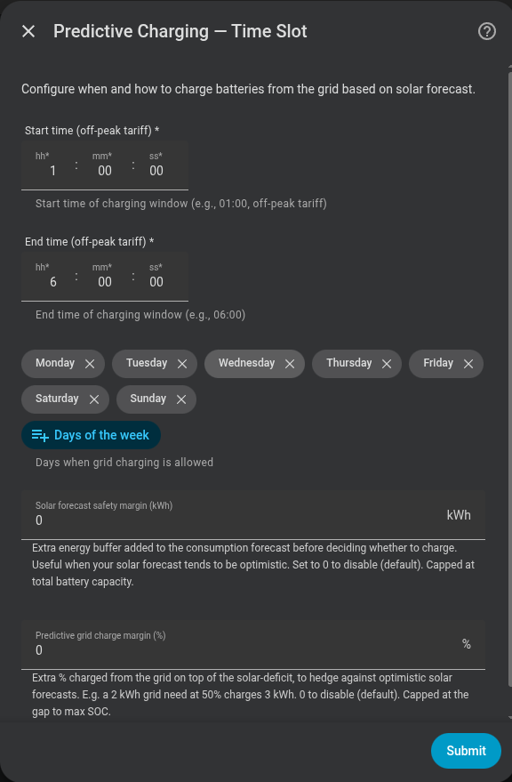

# Predictive charging — Time Slot mode

Charges from the grid during a **fixed time window** (typically cheap overnight tariff).

## Configuration

| Field | Description |
|---|---|
| **Charging window 1** | Start and end of the first charging slot (e.g. `02:00` – `05:00`), plus the days of the week it applies |
| **Charging windows 2 & 3** | (Optional) Up to two more windows, each with its own start/end and days |
| **Solar forecast sensor** | Current-day production sensor in kWh (optional) |
| **Solar forecast safety margin (kWh)** | Extra energy buffer added to consumption forecast before deciding whether to charge (default 0 kWh) |
| **Predictive grid charge margin (%)** | Extra % charged from the grid on top of the solar deficit (default 0%) |

!!! note "Up to 3 windows"
    You can configure 1, 2 or 3 charging windows — useful for a split tariff with both a night and a midday off-peak block. Fill only window 1 for the previous single-window behaviour; each extra window needs **both** a start and an end time (fill both or leave both empty). These windows schedule predictive grid charging only: household-consumption history still covers all 24 hours, while the battery's negative AC power removes its own charging energy from the derived home load.

!!! note "No solar sensor"
    If you have no solar panels, leave the forecast sensor empty. The system will charge whenever battery energy is insufficient to cover expected consumption.

{ width="650"  style="display: block; margin: 0 auto;"}

## Evaluation flow

1. **On slot entry**: the system evaluates the remaining energy balance immediately when no solar forecast is configured or the configured forecast is readable. If the forecast is temporarily unavailable, the evaluation is retried for up to five minutes so a transient provider update does not produce a false decision.
2. **After the evaluation**: the system simulates consumption, solar and usable battery energy in 15-minute intervals until midnight. If the forecast remains unavailable after the retry grace, it evaluates conservatively with zero solar.
3. Every configured window receives its own kWh quota. Energy needed before a projected minimum-SOC crossing is assigned only to windows that can deliver it in time; later energy is distributed across the remaining configured windows.
4. A notification is sent with the decision. If no configured window can meet a deadline, the diagnostic attributes expose the uncovered kWh instead of claiming that a later window covers it.
5. Charging stops when the current window's quota is stored or when the window ends. The first window therefore no longer consumes the whole flexible daily target by default.

The planner never opens an unconfigured charging window. A deadline shortfall means the configured windows or physical charging power cannot deliver enough energy in time; normal household grid import can still occur after the battery reaches its minimum.

## Re-evaluation inside the window

The decision taken on slot entry is not final. While the window is open, the energy balance is evaluated again when:

- **The SOC drops 30 % or more** from the last evaluation point (e.g. due to high consumption).
- **The guaranteed minimum SOC floor is crossed or recovered**, when that option is enabled.
- **The provider revises the solar forecast** by 1.5 kWh or more in either direction. A remaining forecast falls all day by itself, so the stored reading is projected forward by the solar actually produced since it was taken and only the gap against that projection counts as a revision. Bounded by a 30-minute cooldown and four re-evaluations per day.
- **A setting the balance depends on changes**: a battery's minimum or maximum SOC, the solar forecast safety margin, the predictive grid charge margin, or the guaranteed minimum SOC floor.
- **You press the Re-evaluate Predictive Charging button** (`button.*_reevaluate_dynamic_pricing`) on the system device.

Only a re-evaluation that reverses the slot's decision replaces the notification; the others are silent.

These triggers act **inside a charging window only** - outside one there is nothing to re-plan, because this mode never charges from the grid outside its configured windows. If your windows are overnight and the forecast collapses at midday, the correction happens at the next window, not immediately. Dynamic Pricing, which schedules its own slots, does not have this limitation.

Time Slot and Dynamic Pricing use one shared dated solar timeline and one
remaining-energy budget. The learned profile changes intraday deadlines
automatically once it is mature; until then the sinusoidal curve is used. It
never increases the forecast total or opens a window that was not configured.
