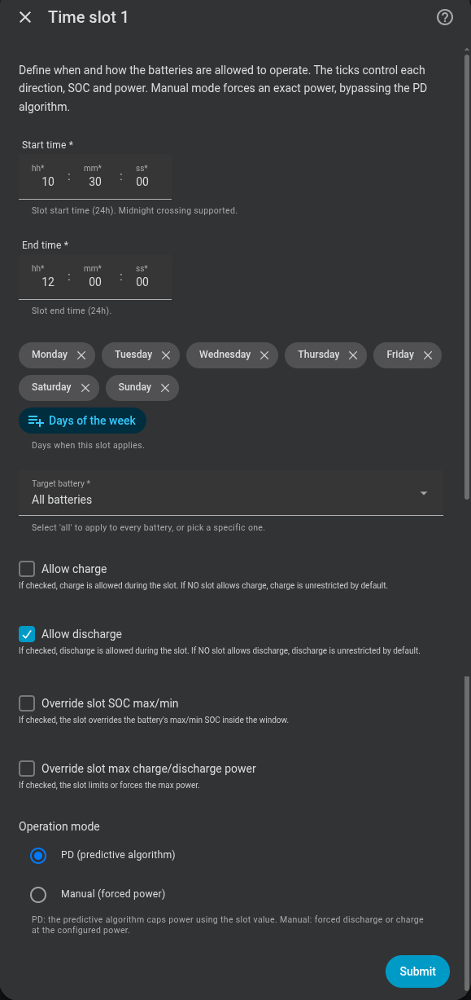

# Horario en el que las baterías pueden funcionar

Las franjas horarias le permiten permitir la carga o descarga solo durante los períodos elegidos. Una ranura también puede limitar el estado de carga (SOC) o la potencia, o forzar una potencia fija cuando eliges deliberadamente la operación manual.

## ¿Lo necesito?

**Úselo si** desea una regla recurrente, como evitar la descarga durante la noche, permitir la carga solo durante horas seleccionadas o aplicar un límite de energía o estado de carga más bajo durante parte del día.

**No lo necesitas si** las baterías pueden seguir el consumo doméstico en todo momento. La carga predictiva tiene su propio cuadro tarifario y no requiere estas franjas operativas.

## Antes de empezar

- Decida qué dirección debe permitir la ranura: carga, descarga o ambas.
- Elija los días, la hora de inicio y finalización y la batería objetivo.
- Para control automático normal, utilice el modo de operación **PD**. El control proporcional-derivado (PD) aún sigue la demanda de la red dentro de la ranura.
- Utilice **Manual** solo cuando desee una carga o descarga exacta y comprenda que la ranura saca temporalmente esa batería de la asignación automática.

## Cómo activarlo

1. Abra **Configuración → Dispositivos y servicios → Omnibattery → Configurar → Franjas horarias** y habilite **Configurar franjas horarias**.
2. Configure **Hora de inicio**, **Hora de finalización**, **Días de la semana** y **Batería objetivo**. El final debe ser posterior al inicio del mismo día.
3. Seleccione **Permitir carga**, **Permitir descarga** o ambos, luego deje **Modo de operación** en **PD** para control automático.
4. Opcional: habilite **Anular SOC máximo/mínimo de ranura** o **Anular potencia de carga/descarga máxima de ranura** y complete el formulario de detalles por batería.
5. Guarde la ranura y agregue otra solo cuando un período o batería diferente necesite una regla separada.

{ width="600" style="display: block; margin: 0 auto;"}

## lo que veras

Cada ranura guardada crea un interruptor **Time Slot N** en el dispositivo del sistema Omnibattery. Apágalo para pausar ese espacio sin borrar sus tiempos y límites; actívelo para restaurar la regla guardada. El estado del interruptor persiste durante los reinicios.

Durante una ranura PD activa, la batería continúa respondiendo a la demanda de la red y del hogar dentro de las direcciones permitidas y los límites de cualquier ranura. Durante una ranura Manual activa, la batería seleccionada se fuerza a la carga o descarga configurada a menos que intervenga un bloqueador de seguridad.

## Si no funciona

| Síntoma | Causa probable | Qué comprobar |
|---|---|---|
| La batería funciona fuera de la ranura | Ninguna ranura habilitada permite esa dirección, por lo que esa dirección permanece sin restricciones | Agregue o habilite al menos una ranura con **Permitir carga** o **Permitir descarga** para la batería de destino |
| La ranura nunca se activa | Su interruptor está apagado, el día de hoy no está seleccionado o su batería objetivo ya no existe | Marque **Ranura horaria N**, los días seleccionados y **Batería objetivo** |
| El formulario rechaza el punto | El final no es posterior al inicio, o se superpone otra ranura para la misma batería | Utilice un período del mismo día y elimine la superposición |
| No aparece un campo de alimentación o SOC | Su casilla de verificación de anulación está desactivada | Habilite la anulación de coincidencias y continúe con el formulario de detalles |
| El modo manual no fuerza la alimentación | Falta la anulación de energía, ambas direcciones están seleccionadas o una regla de seguridad bloquea el comando | Configure una dirección y su potencia, luego verifique el SOC mínimo/máximo y el estado de pausa EV |

??? "Detalles avanzados"
    **Reglas de dirección**

    La carga y descarga se evalúan de forma independiente para cada batería. Si ningún intervalo aplicable habilitado tiene **Permitir cargo**, el cobro no está restringido por intervalos de tiempo. Una vez que cualquier ranura aplicable permita la carga, la carga solo se permitirá dentro de una ranura habilitada coincidente. La misma regla se aplica por separado al alta. Se siguen aplicando el SOC mínimo y máximo, las pausas del vehículo eléctrico, la propiedad manual de la batería y otras reglas de seguridad.

    Esto mantiene los programas migrados sin alta funcionando como ventanas de permiso de alta. Las configuraciones anteriores de aplicabilidad de cargos migran a **Permitir cargo**.

    **Anulaciones y límites**

    Omnibattery acepta hasta 8 ranuras. En forma detallada, el SOC mínimo oscila entre 12 y 30 %, el SOC máximo entre 80 y 100 % y la potencia comienza en 100 W y termina en el hardware máximo de cada batería en pasos de 50 W. En el modo PD, los valores de potencia limitan el control automático. En modo Manual, el valor seleccionado se convierte en la potencia exacta solicitada.

    Una ranura Manual válida necesita la anulación de energía habilitada y exactamente una dirección seleccionada. Ordena directamente a la batería ese ciclo de control y la elimina de la asignación de PD. La propiedad del modo manual de la batería, el SOC mínimo y máximo y la pausa del EV siguen siendo autoritativos. Los comandos manuales de intervalo de tiempo pueden omitir la [sobre automática trifásica](three-phase.md).

    Las ranuras destinadas a diferentes baterías físicas pueden cubrir el mismo período. Las ranuras que apuntan a la misma batería, incluido un visor para todas las baterías, no pueden superponerse. Un objetivo guardado para una batería eliminada de la integración se vuelve inerte hasta que edites o elimines la ranura.

    Para diagnóstico, el sensor binario **Carga predictiva activa** puede exponer `active_slot_per_battery` con la definición de ranura actual y `manual_slot_owned` con baterías controladas por una ranura manual.
