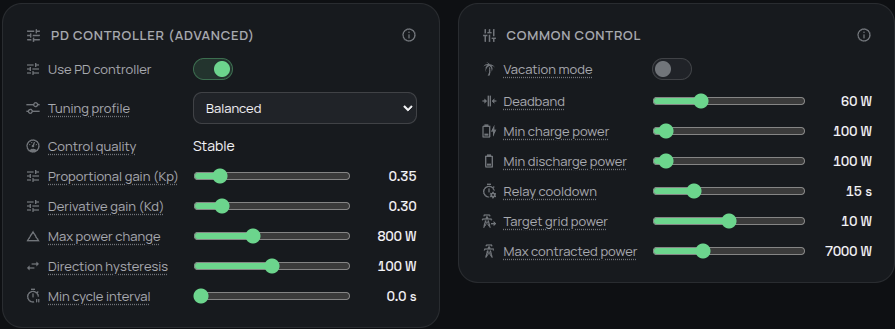

# Follow home consumption

The proportional–derivative (PD) controller adjusts battery power as household demand changes, keeping grid import or export close to your chosen target. Start with **Balanced** and tune it only when you can see a repeatable problem.

## Do I need it?

**Use it if** you want Omnibattery to follow changing home consumption automatically. This is the normal control mode and is suitable for most installations.

**You do not need to tune it if** grid flow stays close to the target without repeated charge/discharge changes. Small, steady differences inside the deadband are intentional and prevent inefficient micro-cycling.

## Before you start

- Configure a working grid consumption sensor that updates regularly.
- Allow Omnibattery to control the battery automatically; manual mode and other active rules can temporarily take control.
- Check that the battery can charge and discharge and is not already at a state-of-charge or power limit.

## How to enable it

1. Open the Omnibattery sidebar panel and select **Control**.
2. In **PD controller**, turn on **PD control**. This turns off **No-PD Direct Tracking** because the two modes are mutually exclusive.
3. Select **Balanced** under **PD tuning profile** and leave the manual gain controls unchanged.
4. Watch **PD Control Quality** while normal household loads change.

{ width="700" style="display: block; margin: 0 auto;"}

## What you will see

**PD Control Quality** gives an actionable verdict:

| State | Meaning | Action |
|---|---|---|
| **Stable** | Grid flow follows the target without persistent hunting | Keep the current settings |
| **Oscillating** | Import and export repeatedly alternate outside the deadband | Follow the hunting row below |
| **Sluggish** | A sustained error closes too slowly | Follow the slow-response row below |
| **Battery limited** | The battery is full, empty, or at a power limit | Check battery limits; tuning cannot add capacity |
| **Blocked** | A schedule, charge delay, price rule, or excluded load prevents the needed action | Find the active rule before tuning |
| **Collecting data** | The metric is warming up or has not received usable control data recently | Wait for normal automatic control to resume |
| **Disabled** | No-PD direct tracking is active | Use its controls instead of PD tuning |

After changing a setting, allow the quality metric to reflect the new behavior before changing another one.

## If it does not work

| Symptom | Likely cause | What to check |
|---|---|---|
| Small import or export remains steady near the target | The error is inside the deadband | Leave it alone unless the difference matters to your tariff; narrowing the deadband can cause more switching |
| Charge and discharge repeatedly alternate | The deadband is too narrow, the profile is too aggressive, or the derivative reacts to meter noise | Increase **PD Deadband** first; then select the next smoother profile; in **Custom**, reduce **Kp**, then **Kd** |
| Response stays slow during a sustained load | The battery is limited or the profile is too smooth | Rule out **Battery limited** or **Blocked** first; then select the next faster profile; in **Custom**, increase **Kp**, then **PD Max Power Change** if the ramp is the limit |
| Large import/export spikes appear after load changes | The inverter is still ramping, or the first correction is too abrupt | Brief spikes can be expected while measured power catches up; for repeated overshoot, choose a smoother profile, then reduce **PD Max Power Change** |
| The battery clicks when entering and leaving idle | Demand hovers around the deadband edge | Increase **PD Relay Cooldown** gradually; it affects active-to-idle transitions only |
| A fast meter causes frequent battery writes | Control cycles arrive faster than the bridge can handle | Increase **PD Min Cycle Interval**; in direct-tracking mode, increase **No-PD Command Delay** instead |
| Quality remains **Battery limited** or **Blocked** | The controller cannot apply the required direction | Check state of charge, battery power limits, time slots, charge delay, pricing rules, and excluded loads |

??? "Advanced details"
    ### Control law and cadence

    The controller runs when the grid sensor publishes a new value. A periodic **2-second safety watchdog** runs in parallel to keep other time-based features moving, and it forces a safety re-evaluation instead of holding the last command indefinitely if the sensor goes silent for about **65 seconds**; a lock serializes overlapping runs.

    The controller uses an incremental control law. Positive command power means battery charging and negative command power means discharging:

    ```text
    error = grid_power - target_power
    P = Kp × error
    D = Kd × filtered_change_in_error / elapsed_time
    new_power = current_power − (P + D)
    ```

    The proportional term and rate limit are scaled by elapsed time, so a faster meter does not multiply the intended correction rate. The derivative is low-pass filtered to reduce meter quantisation and inverter noise. When measured AC power shows that the battery cannot deliver its command, anti-windup logic re-anchors the next correction to measured output.

    The default target is `0 W`: positive grid power is import and negative grid power is export. A [time slot](../configuration/time-slots.md) can set a different target for its active period.

    ### Tuning profiles

    A profile sets **Kp**, **Kd**, and **PD Max Power Change** together. Moving one of those controls switches the selector to **Custom**. **PD Deadband** remains independent.

    | Profile | Kp | Kd | Max change | Intended behavior |
    |---|---:|---:|---:|---|
    | **Very Smooth** | `0.22` | `0.15` | `400 W` | Calmest response for a noisy meter |
    | **Smooth** | `0.30` | `0.25` | `600 W` | Conservative response |
    | **Balanced** | `0.35` | `0.30` | `800 W` | Shipping gains and normal starting point |
    | **Aggressive** | `0.55` | `0.45` | `1,200 W` | Faster response with more overshoot risk |
    | **Very Aggressive** | `0.75` | `0.45` | `2,000 W` | Fastest preset for batteries that can use the full step |
    | **Custom** | — | — | — | Manual control of the three profiled values |

    | Control | Default | Range | Effect |
    |---|---:|---:|---|
    | **PD Target Grid Power** | `0 W` | `±2,500 W` (fallback) | Grid setpoint the PD regulates to. Positive = import from grid (the battery charges), negative = export to grid (the battery discharges). The range follows your configured batteries: three 2,500 W units give a ±7,500 W range. Enabling the system power limits narrows each direction to its configured cap. A [time slot](../configuration/time-slots.md) can set a different target for its active period |
    | **PD Kp** | `0.35` | `0.1–2.0` | Raises or lowers the correction applied to a sustained error |
    | **PD Kd** | `0.30` | `0.0–2.0` | Reacts to changes in error; too much can amplify noisy or delayed readings |
    | **PD Deadband** | `40 W` | `0–200 W` | Ignores small errors around the target |
    | **PD Max Power Change** | `800 W per nominal cycle` | `100–2,000 W` | Limits how abruptly the command can change; internally scaled by elapsed time |
    | **PD Direction Hysteresis** | `60 W` | `0–200 W` | Rejects small requests to reverse charge/discharge direction |
    | **PD Min Charge Power** | `0 W` | `0–2,000 W` | Keeps small charge requests idle; `0 W` disables the minimum |
    | **PD Min Discharge Power** | `0 W` | `0–2,000 W` | Keeps small discharge requests idle; `0 W` disables the minimum |
    | **PD Relay Cooldown** | `0 s` | `0–60 s` | Holds an engaged battery before an active-to-idle transition; `0 s` disables it |
    | **PD Min Cycle Interval** | `1.0 s` | `0–2.0 s` | Drops closer sensor-triggered cycles; `0 s` disables the interval |

    If battery output is capped below the profile's maximum change, the rate limiter may not engage before the battery reaches its cap. Use a smoother profile or set a lower custom maximum change when that first step causes overshoot.

    Minimum charge and discharge power can prevent inefficient low-power operation. During relay cooldown, Omnibattery holds the active direction at the configured minimum or `100 W` when that minimum is disabled. A large imbalance bypasses this hold. Charge-to-discharge reversals use the separate zero-cross protection below.

    System power limits optionally cap the combined charge and discharge power without lowering each battery's own limit. When enabled, the two cap controls appear on the Omnibattery System device; `0 W` disables a cap.

    { width="650" style="display: block; margin: 0 auto;"}

    ### Automatic stabilisation

    - **Deadband:** no correction is made while the error remains inside the configured band.
    - **Direction hysteresis:** a small opposite-direction request is held at idle.
    - **Oscillation detection:** repeated error-sign reversals outside the deadband reset accumulated controller state so proportional control can recover.
    - **Feedforward:** in PD mode, a large load step that persists into the next sample receives one direct, measured-power-anchored correction. A one-sample spike is ignored, opposite pulsing loads are guarded, and ordinary PD adjustment resumes on the following cycle. There is no user setting for feedforward.
    - **Zero-cross hold:** every control path temporarily clamps a charge-to-discharge or discharge-to-charge reversal to idle. The request must persist for at least `5 s`, or twice the slowest battery actuator latency when that is longer. This can produce a brief `0 W` command after a real direction change.

    ### No-PD direct tracking

    **No-PD Direct Tracking** is an optional alternative for a clean, fast meter. It reconstructs household load from measured battery AC power and the grid error, then requests the result directly in one control cycle:

    ```text
    new_power = measured_battery_power − error
    ```

    This path bypasses the PD gains, derivative filter, gradual rate limit, and direction hysteresis. It still uses the deadband, minimum charge/discharge power, relay cooldown, target-grid setting, operating restrictions, and zero-cross hold. **No-PD Command Delay** collapses rapid meter updates into one command using the latest value; its default is `0.0 s` and its range is `0–3.0 s`.

    ### Control quality diagnostics

    The quality metric uses a `60 s` exponential averaging window and pauses after target changes or while control is limited. If it has not advanced for `300 s`, the state returns to **Collecting data**.

    The diagnostic attributes are `rms_error_w`, `oscillation_per_min`, `metric_age_s`, `kp`, `kd`, `deadband_w`, `max_power_change_w`, and `active_profile`.

    ### Backup output exclusion

    A battery with **Backup Function** enabled is excluded when **AC Offgrid Power** exceeds its **Backup Offgrid Threshold**, or when that power reading is unavailable. The default threshold is `50 W`, so small permanent loads on the backup output do not remove the battery from normal control.

    While excluded, Omnibattery continues polling read-only data but sends no power, forced-mode, configuration, or weekly full-charge commands to that battery. After off-grid power returns below the threshold, exclusion remains for `5 min`; turning **Backup Function** off clears the cooldown immediately.
