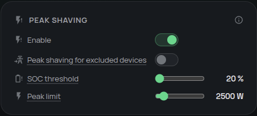

# Reserve battery power for demand peaks

Protect your installation with capacity protection (peak shaving): below a battery state of charge (SOC) threshold, Omnibattery saves energy for demand that would exceed your chosen grid-import limit. This can reduce contracted-power peaks and keep a reserve for later.

## Do I need it?

**Use it if** your tariff penalizes high import peaks, your installation has a practical import ceiling, or normal household tracking empties the battery before the period when large loads appear.

**You do not need it if** you want the battery to cover ordinary household demand down to its normal minimum SOC and have no separate peak limit to protect.

Peak shaving is an optional reserve strategy. Contracted-power emergency protection is separate and can still protect the physical grid connection during predictive charging.

## Before you start

- Confirm that **Home Consumption** and grid import have the correct sign and follow real loads.
- Choose the battery SOC below which ordinary discharge should stop.
- Choose the grid-import level above which the battery should intervene. This is separate from the configured maximum contracted power.
- If large loads are [excluded from normal battery coverage](../configuration/excluded-devices.md), decide whether peaks from those loads should also be shaved.

## How to enable it

1. Open the Omnibattery sidebar panel and select **Control**.
2. Turn on **Peak Shaving**.
3. Set **Peak Shaving SOC Threshold**. Below this average fleet SOC, the battery preserves capacity for peaks.
4. Set **Peak Shaving Limit** to the grid-import threshold you want the battery to hold.
5. Optional: turn on **Peak Shaving for Excluded Devices** if normally excluded loads should also respect that limit.

| Setting | Default | Range |
|---|---:|---:|
| **Peak Shaving SOC Threshold** | `30%` | `20–100%` |
| **Peak Shaving Limit** | `2,500 W` | `500–20,000 W` |

{ width="650" style="display: block; margin: 0 auto;"}

## What you will see

Above the SOC threshold, normal household tracking continues. Below it:

- Demand at or below the peak limit stays on the grid so the battery preserves its reserve.
- Demand above the limit is covered only by the amount needed to bring import back toward the limit.
- Solar surplus can still charge the battery.

For example, with a `3,000 W` limit and `4,500 W` of household demand, the battery supplies `1,500 W` and the grid supplies `3,000 W`. At `2,000 W` of demand, the battery remains idle.

**Peak Shaving Active** and the integration status distinguish shaving a peak, conserving capacity, charging from surplus, and idle operation. A configured relay cooldown may briefly hold minimum battery power after the controller asks for idle; this is expected relay protection rather than a new charge or discharge decision.

{ width="650" style="display: block; margin: 0 auto;"}

See the [daily operation timeline](daily-operation-timeline.md) to compare peak-shaving actions with household demand, and [predictive charging](../configuration/predictive-charging/index.md#household-demand-during-a-charging-slot) for the import-protection sequence during a charging period.

## If it does not work

| Symptom | Likely cause | What to check |
|---|---|---|
| The battery still covers ordinary demand | Average battery SOC is above the conservation threshold | **Peak Shaving SOC Threshold** and **Peak Shaving Active** |
| A peak remains above the limit | Available battery discharge power or another safety rule is limiting output | Minimum SOC, battery availability, phase limits, backup state, and power limits |
| An excluded load is not shaved | The separate excluded-device option is off | **Peak Shaving for Excluded Devices** |
| The battery does not fall to idle immediately | Relay cooldown is holding minimum power or telemetry is settling | PD relay cooldown and live battery power |
| Predictive grid charging pauses | Household import reached the applicable ceiling | Predictive charging status, **Peak Shaving Limit**, and maximum contracted power |
| The battery discharges during a price-protected period | A physical peak or contracted-power emergency takes priority | Grid import and the active protection status |

??? "Advanced details"
    Below the conservation threshold, Omnibattery reconstructs household load from grid and battery AC telemetry and applies this target:

    ```text
    battery_discharge = max(0, household_load - peak_limit)
    ```

    The average SOC excludes unavailable and manually controlled batteries. Minimum SOC, battery availability, manual or time-slot control, backup restrictions, phase protection, and battery/system power limits still apply.

    **Peak Shaving for Excluded Devices** is disabled by default. Above the conservation threshold, ordinary home coverage stays unchanged and only the excluded share that would leave physical grid import over the limit is added back. With `1,000 W` of normal demand, `4,000 W` excluded, and a `3,000 W` limit, the battery supplies `2,000 W`: `1,000 W` for normal demand and `1,000 W` to shave the excluded load. Below the threshold, capacity protection already applies the limit to total demand.

    During an active predictive charging period, household demand has priority. Omnibattery first reduces positive battery charging, then commands idle and waits for inverter and meter telemetry to settle. If import remains too high, Peak Shaving uses the lower of its configured limit and maximum contracted power. Independently, physical import above maximum contracted power can trigger emergency discharge, including for excluded loads seen by the grid connection.

    Price-based discharge restrictions and protected negative-price periods cannot suppress a legitimate peak-shaving or contracted-power emergency command. Stopping predictive charge, Peak Shaving discharge, normal proportional–derivative (PD) discharge, and emergency discharge remain separate actions. When stable import capacity returns, discharge stops, telemetry settles, and predictive charging resumes with hysteresis; its SOC target and pending energy remain preserved.

    Relay cooldown is optional and defaults to `0 seconds`. When configured, an active-to-idle request can hold the already active direction at the configured minimum power, or `100 W` when no minimum is set, until the selected cooldown expires. A large imbalance bypasses the hold. This protects the relay from rapid off/on cycling and does not delay direct charge-to-discharge direction changes.
