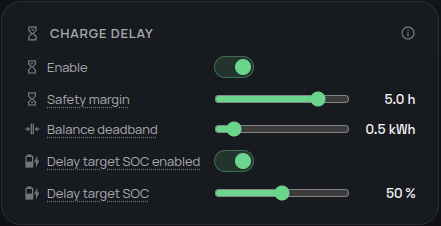

# Espera al sol antes de cargar

Aprovecha al máximo la energía solar retrasando la carga de la batería mientras la previsión de hoy aún pueda cubrir la demanda del hogar y la energía que necesita la batería. Así evitas llenar pronto la batería desde la red o con energía solar matinal de poco valor cuando se espera suficiente sol más tarde.

## ¿Lo necesito?

**Úsalo si** tu batería suele empezar a cargarse por la mañana aunque la solar posterior podría completar la carga. También puede permitir que la solar complete una carga semanal completa antes de recurrir a la red.

**No lo necesitas si** no tienes una previsión solar utilizable, quieres que la carga empiece en cuanto haya energía disponible o algún otro horario debe controlar siempre el momento de carga.

## Antes de empezar

- Configura un sensor de previsión solar en [Sensores y límites eléctricos](../configuration/main-sensor.md). Un sensor **Restante hoy** ofrece la entrada más clara; las entradas antiguas con sensores de día completo guardados se convierten automáticamente.
- Deja que la [estimación de consumo del hogar](consumption-estimate.md) aprenda tu demanda. El retraso usa el perfil maduro por hora cuando está disponible y recurre a la estimación diaria mientras aprende.
- Decide si una batería muy descargada debe alcanzar primero un estado de carga (SOC) garantizado antes de esperar al sol.

## Cómo activarlo

1. Abre el panel lateral de Omnibattery y selecciona **Control**.
2. Activa **Retraso de carga**.
3. Configura **Margen de retraso de carga** para dejar tiempo suficiente para terminar de cargar antes de que finalice la producción solar prevista.
4. Opcional: activa **Activar SOC mínimo antes del retraso** y configura **Objetivo de SOC del retraso de carga** para que la batería cargue hasta ese nivel antes de esperar.
5. Comprueba el **Sensor de previsión solar** seleccionado y guarda la configuración.

{ width="650" style="display: block; margin: 0 auto;"}

## Qué verás

**Retraso de carga** explica la decisión actual:

| Estado | Significado |
|---|---|
| `Disabled` | La función está desactivada |
| `Charging to setpoint` | Se permite cargar hasta que cada batería controlada alcance el objetivo de SOC opcional |
| `Waiting for forecast` | Una previsión configurada no está disponible temporalmente; el retraso se mantiene durante el periodo de gracia |
| `Charging allowed` | El retraso se ha liberado para el resto del día |
| Retrasado / esperando al sol | La previsión y la demanda restante del hogar indican que la solar puede completar la carga más tarde |

El sensor también muestra la hora de liberación prevista. Durante la fase de objetivo, `estimated_setpoint_time` y `projected_unlock_time` son proyecciones; tras activarse el retraso, `estimated_unlock_time` es la estimación actual del controlador.

Una vez que una decisión normal de previsión libera el retraso, la carga sigue permitida durante el resto de ese día local. Para volver a evaluarlo desde cero, desactiva y vuelve a activar **Retraso de carga**.

{ width="650" style="display: block; margin: 0 auto;"}

Consulta la [cronología diaria de funcionamiento](daily-operation-timeline.md) para ver el marcador del retraso junto con la solar prevista, el consumo y las acciones de batería.

## Si no funciona

| Síntoma | Causa probable | Qué comprobar |
|---|---|---|
| La carga empieza inmediatamente | La previsión no puede cubrir la demanda restante y la energía de batería, o se ha alcanzado el margen de hora de finalización | **Retraso de carga**, energía prevista, hora de liberación prevista y margen |
| La batería carga antes de esperar | Está activado el objetivo de SOC opcional | `Charging to setpoint` y **Objetivo de SOC del retraso de carga** |
| El estado indica `Waiting for forecast` | El sensor de previsión se está actualizando o no ha cargado tras reiniciar | La entidad de previsión; espera a que se recupere antes de cambiar ajustes |
| El retraso usa una alternativa diaria | El perfil del hogar no está maduro | [Perfil de consumo esperado de la casa](consumption-estimate.md) y sus atributos de madurez |
| El retraso nunca empieza | No hay sensor de previsión configurado, la función está desactivada o la política de carga semanal completa lo anula | **Retraso de carga**, el sensor de previsión seleccionado y los ajustes de carga semanal completa |
| Un retraso liberado previamente debería aplicarse de nuevo hoy | Una liberación genuina queda fijada para el día | Desactiva y activa **Retraso de carga** para forzar una decisión nueva |

??? "Detalles avanzados"
    Omnibattery modela la producción solar del día actual como una curva sinusoidal y compara la solar prevista restante hasta que termina la producción con la demanda restante del hogar y la energía de batería:

    ```text
    net_solar_for_battery = remaining_solar - remaining_consumption

    if net_solar_for_battery can cover energy_to_charge:
        keep waiting
    else:
        allow charging
    ```

    Omnibattery lee la previsión solar en directo sin una captura nocturna ni almacén de previsiones independiente. Un sensor guardado **Restante hoy** se usa directamente; las entradas antiguas de día completo sin modificar se convierten en una estimación de producción restante.

    El balance en directo se recalcula cuando la energía prevista cambia más de `0.05 kWh`, o cuando cambia su origen o conversión. Una previsión que empeora puede liberar el retraso inmediatamente; una que mejora mantiene el retraso activo hasta que se cumpla otra condición de liberación.

    Un perfil maduro del hogar proporciona la demanda restante desde ahora por hora local. Las franjas de carga siguen en el rango solicitado porque la casa continúa consumiendo mientras funciona la batería; la energía de carga desde red de la batería ya queda cancelada por el término de potencia de CA. La demanda observada antes hoy no se cuenta de nuevo. Los atributos de diagnóstico incluyen `consumption_forecast_source`, `profile_coverage_ratio` y `profile_days`.

    La comprobación energética usa un colchón del `30%`:

    ```text
    release when net_solar < energy_needed × 1.3
    ```

    Si solo falta el colchón mientras el requisito energético básico aún está cubierto, un modo predictivo basado en precio espera a la hora viable restante más barata, limitada por el punto proyectado en que el balance básico fallaría. Un déficit genuino libera inmediatamente, igual que un día sin datos de precio utilizables.

    Una previsión configurada que pasa a `unavailable` o `unknown` no desactiva el retraso inmediatamente. El estado permanece `Waiting for forecast` durante un periodo de gracia de `5-minute`. Un valor provisional de `0 kWh` de **Restante hoy** también se mantiene durante la primera hora tras la medianoche local. Si los datos no se recuperan, la liberación sigue pudiendo reevaluarse en lugar de fijar permanentemente una decisión de previsión engañosa.

    El objetivo de SOC opcional abarca `12–90%`, tiene `50%` como valor predeterminado cuando se activa y está desactivado de forma predeterminada. Por debajo de él se permite cargar y cada batería se detiene individualmente al alcanzar el objetivo mientras las baterías más bajas se igualan. Tras alcanzarlo todas las baterías controladas, el retraso por previsión se aplica a la flota. Un objetivo alcanzado solo se rearma tras caer el SOC `3` puntos porcentuales por debajo. Durante esta fase, los atributos de diagnóstico incluyen `soc_setpoint`, `estimated_setpoint_time` y `projected_unlock_time`.

    **Margen de retraso de carga** abarca `1–6 h` y su valor predeterminado es `1 h`: un valor mayor libera antes, mientras uno menor espera más. **Banda muerta del balance del retraso de carga** tiene por defecto `0.5 kWh` e impide que una estimación diaria casi equilibrada cambie repetidamente la decisión inicial de necesidad de red.
