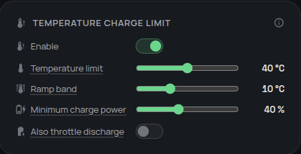

# Temperature charge limit

Temperature charge limit protects a hot battery by reducing its power as the internal temperature rises. Use it as an extra operating limit alongside the battery management system (BMS), whose own safety protections remain authoritative.

## Do I need it?

**Use it if** one or more batteries repeatedly run hot because of their location, weather, or sustained high power, and you prefer a gradual reduction before the BMS reaches its own cutoff.

**You do not need it if** battery temperatures remain comfortable at full power, or if your battery does not publish an internal-temperature reading to Omnibattery.

## Before you start

- Confirm that each battery you want to protect has an **Internal Temperature** entity with a numeric value.
- This is a system-level feature, but Omnibattery calculates the limit separately for each battery from its own temperature.
- Decide whether charging alone should be limited. Discharge limiting is optional and uses the same temperature curve.

## How to enable it

1. Open the Omnibattery sidebar dashboard and select **Control**.
2. In **Temperature Charge Limit**, turn on **Temperature Charge Limit**.
3. Set **Temperature Charge Limit**, **Temperature Charge Limit Band**, and **Temperature Charge Limit Floor**.
4. Turn on **Temperature Discharge Limit** only if you also want hot batteries to reduce discharge power.

{ width="650" style="display: block; margin: 0 auto;"}

The default controls are:

| Control | Effect | Default |
|---|---|---:|
| **Temperature Charge Limit** | Full power is allowed at or below this temperature; reduction begins above it | 40 °C |
| **Temperature Charge Limit Band** | Temperature span over which power falls toward the configured floor | 10 °C |
| **Temperature Charge Limit Floor** | Lowest percentage of the current power ceiling at the top of the band | 40% |
| **Temperature Discharge Limit** | Applies the same curve to discharge | Off |

## What you will see

Below the configured limit, this feature does not change the battery's power ceiling. As the battery heats through the ramp band, the permitted power falls smoothly; as it cools, power rises smoothly again.

With the defaults, reduction starts above 40 °C and reaches the 40% floor at 50 °C. Other active battery limits can still produce a lower ceiling.

**Integration Status** includes `temperature_charge_limit` details for each battery: its reported temperature, configured limit, ramp band, floor, reduction factor, and whether derating is active.

## If it does not work

| Symptom | Likely cause | What to check |
|---|---|---|
| Power does not reduce when a battery is hot | The feature is off, or the temperature has not crossed the configured limit | **Temperature Charge Limit**, **Internal Temperature**, and the configured threshold |
| One battery reduces power and another does not | Limits are calculated from each battery's own temperature | Both batteries' **Internal Temperature** values |
| A battery with no temperature reading keeps charging | Missing or invalid temperature data leaves its existing limit unchanged | Battery availability and the internal-temperature entity |
| Power does not fall as low as the percentage suggests | The driver declares a minimum reliable operating power | The battery's supported power range and **Integration Status** |
| Discharge remains unrestricted | Discharge limiting is optional | **Temperature Discharge Limit** |

??? "Advanced details"
    The configured floor is a percentage of the current per-battery ceiling, after any earlier control limit. For temperature `T`, limit `L`, ramp band `B`, and floor fraction `F`, Omnibattery uses:

    ```text
    factor = 1                                      when T <= L
    factor = 1 - ((T - L) / B) × (1 - F)           when L < T < L + B
    factor = F                                      when T >= L + B
    temperature_limited_power = current_limit × factor
    ```

    The curve is continuous and has no separate cooldown latch or hysteresis. A missing or non-numeric temperature passes the existing limit through unchanged.

    Omnibattery never raises a ceiling imposed elsewhere. After applying the percentage, it also respects any minimum reliable charge or discharge power declared by the battery driver. Drivers that declare no minimum can reach 0 W when the configured floor is 0%; a driver with a non-zero minimum remains at that declared operating floor.

    **Temperature Discharge Limit** uses the same charge-tuned curve. It is disabled by default because discharge may tolerate heat differently; enable it when reducing both directions is appropriate for your installation.
