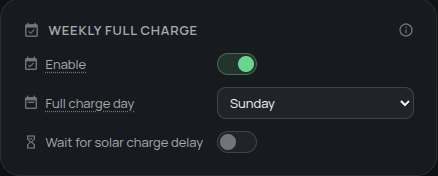

# Weekly full charge

A weekly full charge gives a lithium iron phosphate (LFP) battery regular time at the top of its charge range and produces a comparable cell-balance reading. It is most useful when your normal maximum state of charge (SOC) is below 100%.

## Do I need it?

**Use it if** your battery rarely reaches 100%, or if you want a regular balance check without starting a full charge yourself.

**You do not need it if** the battery already reaches 100% regularly. A full charge can also buy grid energy, so choose the day and solar-delay behavior to suit your tariff.

## Before you start

- Omnibattery must be able to charge the battery automatically.
- Leave **100% Charge Voltage Taper** on for each compatible battery if you want a settled cell-balance reading.
- If **Charge Delay** is enabled, decide whether the weekly cycle may start immediately or should wait for expected solar.
- A battery in **Manual Battery Control** is excluded until automatic control resumes.

## How to enable it

1. Open the Omnibattery sidebar dashboard and select **Control**.
2. In **Weekly Full Charge**, turn on **Weekly Full Charge**.
3. Choose **Weekly Full Charge Day**.
4. If you use **Charge Delay**, turn on **Delay Weekly Full Charge** to wait for solar; leave it off to start the weekly cycle without that delay.

{ width="650" style="display: block; margin: 0 auto;"}

## What you will see

**Weekly Full Charge** reports `idle`, `charging`, or `complete`. On the selected day, Omnibattery temporarily raises the charge target to 100% for batteries under automatic control. It marks the cycle complete only after every participating battery is considered full, then restores each configured limit.

With [predictive charging](../configuration/predictive-charging/index.md), the remaining energy needed for the weekly target enters the plan. Omnibattery can buy that energy during the configured charging period when forecast solar will not cover it. Without predictive charging, the cycle relies on available solar and may not complete on a cloudy day.

The sensor's `batteries` attribute shows the live SOC and completion evidence for each battery. On compatible batteries, **Cell Delta**, **Balance Status**, and **Last Balance Read** update after the top-of-charge measurement. See [Is my battery healthy?](cell-balance-monitor.md) to interpret the result.

!!! important "Solar delay behavior"
    **Delay Weekly Full Charge** is off by default. The weekly cycle therefore bypasses **Charge Delay** and can start on its selected day. Turn the switch on if you prefer it to wait for the solar delay to release charging.

## If it does not work

| Symptom | Likely cause | What to check |
|---|---|---|
| The status stays `idle` | Today is not the selected day, or the feature is off | **Weekly Full Charge** and **Weekly Full Charge Day** |
| The cycle is waiting instead of charging | The weekly cycle is respecting the solar delay | **Delay Weekly Full Charge** and **Charge Delay** |
| One battery does not participate | Per-battery manual control owns it, or its data is unavailable | **Manual Battery Control** and the battery's availability |
| The cycle remains `charging` near full | The battery management system (BMS) has not confirmed that every participating battery is full | The per-battery details in **Weekly Full Charge**; allow the top-of-charge process to finish |
| The cycle completes but no balance result appears | The battery does not expose both cell-voltage extremes, or the diagnostic rest measurement could not finish | Whether **Cell Delta** exists and **Last Balance Read** changed |

??? "Advanced details"
    **Charge and completion sequence**

    The weekly feature raises the target SOC to 100%; it does not use a separate balancing algorithm. With **100% Charge Voltage Taper** enabled, charging is limited to 200 W after the control cell voltage enters the 3.48 V taper zone. The balance measurement is taken after charging stops and the cells rest for 60 seconds.

    Omnibattery does not treat a single 3.60 V observation as proof that a battery is full. For Venus E batteries, completion can come from a reported SOC of 100% or a confirmed BMS cutoff. A cutoff is confirmed when the battery was commanded to charge, delivered power falls to 10 W or less, and the inverter remains in Standby for five consecutive control cycles. The same cutoff path covers a pack whose SOC counter has drifted below 100%.

    Venus A/D batteries can contain coupled packs. Their reported maximum cell voltage may represent only one pack, so Omnibattery keeps the 200 W tapered command active until the BMS cutoff is confirmed. A pack reaching the voltage threshold cannot finish the whole cycle by itself.

    Every battery with current data participates except batteries in **Manual Battery Control**. Configured limits are restored only after all participating batteries complete. The 60-second cell-delta measurement is diagnostic and does not hold the weekly cycle open.

    **SOC recalibration and retry behavior**

    Outside the weekly cycle, a Venus E battery that reaches 3.60 V while reporting below 99% SOC can be kept at the 200 W taper until its BMS cuts off. If the first cutoff occurs above 3.60 V and SOC is still below 100%, Omnibattery waits for the cell to relax to 3.57 V and permits one more 200 W attempt. This is a best-effort opportunity for the BMS to recalibrate its SOC counter; firmware decides whether recalibration occurs.

    **Hardware and software limits**

    Marstek Venus E v2 exposes charging-cutoff register `44000`, which the cycle temporarily raises to 100%. Venus E v3 and Venus A/D have no hardware SOC-cutoff register in Omnibattery and use software enforcement. Other drivers use their declared hardware or software control capability. In every case, the saved limit is restored when the cycle completes or is stopped.

    For recovery of a persistent red balance result, use the optional [Marstek active-balance blueprint](../automations/blueprints.md#active-cell-balancing-for-one-marstek-battery). It takes control of one battery through **Manual Battery Control** and is independent of the weekly feature.
