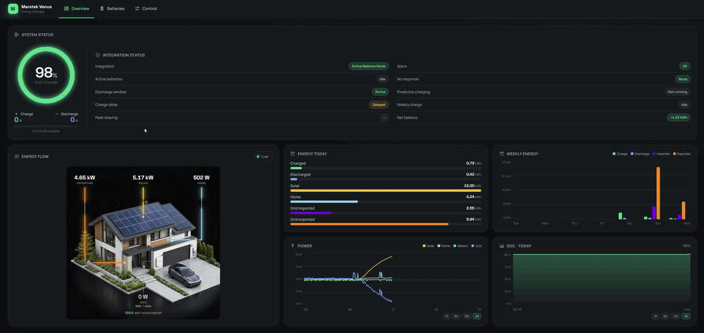

{ width="420" }

# Usa la batería de tu casa para reducir los costes de red

Omnibattery conecta baterías domésticas compatibles a Home Assistant para que sigan el consumo de la casa, almacenen la energía solar disponible y carguen cuando tu horario o el precio de la electricidad lo hagan conveniente.

## ¿Es Omnibattery para mí?

**Úsalo si** ya tienes una batería compatible y un sensor de Home Assistant que mide la potencia importada de la red o exportada a ella. Es especialmente útil si quieres un único lugar para coordinar baterías, previsiones solares, precios de electricidad y cargas domésticas.

**No lo necesitas si** el control del propio fabricante ya cubre tus necesidades, o si solo quieres ver datos de la batería sin que Home Assistant ajuste su potencia.

Comprueba [si tu batería exacta es compatible](compatibility.md) antes de instalar.

## Marcas compatibles de un vistazo

| Marca | Cómo se conecta Omnibattery | Empieza aquí |
|---|---|---|
| **Marstek Venus** | Modbus TCP, Modbus RTU o un puente LilyGo RS-485/ESPHome | [Configuración de Marstek](configuration/batteries/marstek.md) |
| **Zendure SolarFlow** | API HTTP local | [Configuración de Zendure](configuration/batteries/zendure.md) |
| **Anker SOLIX Solarbank** | Modbus TCP | [Configuración de Anker SOLIX](configuration/batteries/anker.md) |
| **Huawei SUN2000 + LUNA2000** | Modbus TCP a través del inversor | [Configuración de Huawei](configuration/batteries/huawei.md) |
| **Sessy Home Battery** | API HTTP local a través del dongle Sessy | [Configuración de Sessy](configuration/batteries/sessy.md) |
| **Hoymiles MS-A2 y HiBattery** | MQTT a través de Home Assistant | [Configuración MQTT de Hoymiles](configuration/batteries/hoymiles.md) |

Omnibattery puede coordinar marcas compatibles en la misma instalación. Consulta los [requisitos de instalación](installation.md#before-you-start) antes de cambiar ajustes del fabricante.

## Qué puede hacer por ti

-   :material-home-lightning-bolt: **Ajustar la potencia de la batería al consumo de casa**

    Reduce la importación o exportación de red no deseada cuando se encienden y apagan los electrodomésticos.

-   :material-white-balance-sunny: **Aprovechar mejor la energía solar**

    Combina producción en directo, capacidad de la batería y previsiones para decidir cuándo almacenar energía.

-   :material-currency-eur: **Cargar cuando la energía de red tiene sentido**

    Usa franjas horarias o precios de electricidad para comprar solo la energía que previsiblemente necesitará tu casa.

-   :material-battery-sync: **Coordinar varias baterías**

    Reparte la demanda entre baterías compatibles respetando los límites de carga, descarga y estado de carga de cada una.

## Cómo empezar

1. [Comprueba los requisitos e instala Omnibattery](installation.md).
2. Añade la integración y conecta el sensor de red y la batería.
3. Abre el panel lateral de Omnibattery para confirmar la potencia y el estado de carga; después activa solo las funciones que encajen con tu casa.

¿Ya usas **Marstek Venus Energy Manager**? Sigue la [guía de actualización](upgrading-from-marstek-vem.md) para mantener conectados tus ajustes, el historial de entidades y los paneles.

## Tu panel de control

El panel lateral se instala con la integración; no requiere otra tarjeta de Home Assistant Community Store (HACS) ni configuración YAML de panel. Usa **Resumen** para seguir el flujo de energía en directo y el historial diario, **Baterías** para revisar cada unidad y **Control** para activar y ajustar funciones opcionales.

??? "Detalles avanzados"
    El controlador proporcional–derivativo (PD) de Omnibattery reacciona cuando el sensor de red publica un valor nuevo y ajusta la potencia de la batería hacia el objetivo de red configurado, incluida la importación o el vertido cero. Los perfiles de ajuste, de **Muy suave** a **Muy agresivo**, y el sensor **PD Control Quality** ayudan a identificar una respuesta estable, oscilante o lenta. Un modo opcional de seguimiento directo sigue la lectura de red 1:1 en un ciclo de control, sin comportamiento integral, derivativo, de suavizado ni de limitación de rampa.

    La integración puede coordinar hasta diez baterías. Usa prioridades de estado de carga, histéresis de energía y reparto que considera la eficiencia, a la vez que aplica límites de potencia por batería y del sistema. Consulta [Gestión de varias baterías](features/multi-battery.md).

    La pestaña **Resumen** del panel incluye un anillo animado de estado de carga, un diagrama de flujo Red↔Casa↔Batería↔Solar, diagnósticos, gráficos de historial y una cronología diaria medida/proyectada. **Baterías** muestra la potencia, estado de carga, salud, celdas, energía diaria, entradas opcionales de seguimiento del punto de máxima potencia (MPPT), firmware y controles de cada unidad.

    Las funciones energéticas opcionales incluyen:

    - [Carga predictiva](configuration/predictive-charging/index.md) mediante franjas horarias, precios dinámicos o precios en tiempo real, incluido Tibber; su estimación de demanda utiliza un historial móvil de siete días del consumo doméstico
    - [Franjas horarias](configuration/time-slots.md) para ventanas independientes de carga y descarga, cada una con sus propios ajustes de estado de carga y potencia
    - [Protección de capacidad (peak shaving)](features/peak-shaving.md) para reservar energía para demanda por encima de un umbral configurado
    - [Carga completa semanal](features/weekly-full-charge.md), que puede cargar al 100% para el equilibrado, y un [monitor de equilibrio de celdas](features/cell-balance-monitor.md) que registra la diferencia de tensión entre celdas y protege el periodo de reposo en circuito abierto
    - [Retraso de carga solar](features/solar-charge-delay.md) cuando la producción prevista puede llenar la batería más tarde
    - [Balance neto horario](features/hourly-net-balance.md), que ajusta el objetivo PD hacia un resultado de energía de red horario configurable y puede usar un sensor de balance externo
    - [Exclusión de cargas](features/load-exclusion.md) para cargadores de vehículo eléctrico y otras cargas grandes, con un ajuste individual de exclusión de 0–100%
    - Notificaciones proactivas de fallos y alarmas de Home Assistant cuando un controlador de batería proporciona esa telemetría; **System Alarm Status** resume la flota como `OK`, `Warning` o `Fault`

    El estado de carga (SOC) es la energía utilizable restante de la batería. El sistema de gestión de batería (BMS) aplica los límites propios de celdas y seguridad del dispositivo además de los controles de software de Omnibattery.

## Aviso de responsabilidad

!!! danger "Exención de responsabilidad"
    Este software se proporciona "tal cual", sin garantía de ningún tipo. El uso es bajo tu propio riesgo. El desarrollador no asume ninguna responsabilidad por daños a baterías, inversores, instalaciones eléctricas, pérdidas económicas o lesiones personales.

    **Si no aceptas estos términos, no instales ni uses esta integración.**

## Soporte

Si esta integración te resulta útil, puedes apoyar el proyecto:

