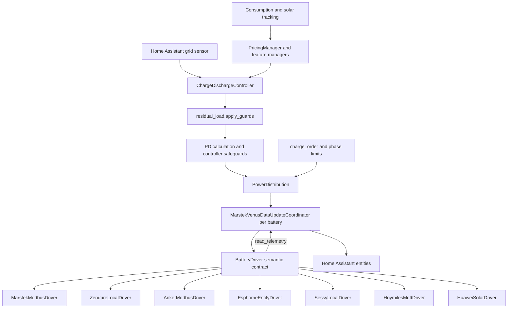

# Arquitectura

Esta página presenta el código actual de Omnibattery para colaboradores. Muestra dónde termina el soporte de hardware, dónde empieza el control compartido y qué módulos poseen cada parte de un ciclo de telemetría o de consigna.

## Mapa del sistema

Omnibattery crea un `MarstekVenusDataUpdateCoordinator` por cada batería configurada. La clase conserva su nombre histórico, pero coordina todas las marcas admitidas. Cada coordinador posee un `BatteryDriver` concreto, su bloqueo de conexión, caché de telemetría, calendario de sondeo, estado de salud y límites efectivos.

Una entrada de configuración también crea un `ChargeDischargeController` para la flota. El controlador lee el sensor de red de Home Assistant, combina bloqueadores y anulaciones de funciones, calcula la orden de flota, pide a `PowerDistribution` que seleccione baterías y distribuya potencia, y después escribe mediante cada coordinador y controlador.

El controlador y las plataformas de entidades no usan direcciones de registros, rutas HTTP ni temas MQTT. Esos detalles permanecen dentro de `drivers/` y de los clientes de transporte en `infra/`.

## El límite del controlador

`custom_components/omnibattery/drivers/base.py` define el límite semántico con el hardware:

- `BatteryDriver` representa una batería física y posee su transporte.
- `DriverCapabilities` describe rasgos estáticos en los que puede basarse el código compartido.
- `ReadGroup` agrupa claves lógicas de telemetría por cadencia de sondeo.
- `TelemetrySnapshot` es un mapeo plano de claves lógicas a valores decodificados.
- `SetpointResult` informa de la orden con signo aplicada, el estado de confirmación, la entrega medida, el motivo de fallo y cualquier estado nativo que deba fusionarse en la caché del coordinador.

El contrato usa potencia neta con signo en todo momento: vatios positivos para carga, negativos para descarga, y solicitudes de `0 W` para reposo. Un controlador traduce ese significado a sus propios modos, límites, registros, servicios o entidades.

### Superficie abstracta de `BatteryDriver`

| Área | Miembro | Responsabilidad |
|---|---|---|
| Identidad | `capabilities` | Devuelve el `DriverCapabilities` inmutable de este dispositivo. |
| Ciclo de vida | `connected`, `connect()`, `close()`, `set_shutting_down()` | Posee el estado de conexión y libera recursos de transporte. |
| Telemetría | `read_groups`, `read_telemetry(keys)` | Planifica y devuelve valores lógicos decodificados; omite los que fallen. |
| Control neto | `apply_setpoint(net_power_w, mode_hint=None, read_back=True)` | Limita y traduce una orden de flota con signo a operaciones del dispositivo. |
| Control de entidad | `write_control(key, value)` | Gestiona una escritura lógica de número, selector, interruptor o botón. |
| Eco de orden | `net_power_from_data(data)` | Reconstruye la orden actual reflejada para la lógica de omitir si no ha cambiado. |
| Dependencias | `control_dependency_keys` | Mantiene el sondeo de telemetría crítica para el control aunque su entidad esté deshabilitada. |

La clase base también proporciona ganchos opcionales para acoplamiento en CC, identidad de modelo y serie, dependencias de balance, medida suplementaria de descarga y un techo dinámico de descarga.

Actualmente, el coordinador llama por convención a estos métodos de controladores concretos aunque no sean miembros abstractos de `BatteryDriver`: `apply_config()`, `set_charge_cutoff()`, `standby()`, `set_rs485_control()` y, para controladores con una compuerta de control externo, `get_rs485_control()`. Un controlador nuevo debe implementar el comportamiento aplicable y devolver `False` de forma controlada en operaciones de escritura no admitidas.

### Capacidades

El código compartido lee `coordinator.capabilities`; no debe ramificarse según una marca o cadena de firmware. `DriverCapabilities` contiene actualmente todos estos campos:

| Grupo | Capacidad | Significado |
|---|---|---|
| Control | `hardware_soc_cutoff` | El dispositivo aplica por sí mismo los cortes de estado de carga (SOC) configurados. |
| Control | `has_force_mode` | El dispositivo expone un modo diferenciado de carga, descarga o reposo forzado. |
| Control | `has_rs485_control` | Se puede conmutar una compuerta externa de control RS-485 o Modbus. |
| Potencia | `max_charge_power_w`, `max_discharge_power_w` | Envolvente inclusiva de potencia por dispositivo. |
| Potencia | `min_charge_power_w`, `min_discharge_power_w` | Orden distinta de cero fiable más baja en cada sentido. |
| Tiempo | `actuator_latency_s` | Tiempo aproximado de respuesta física usado por la protección de cambio de sentido. |
| Tiempo | `readback_latency_s` | Tiempo hasta que la telemetría de la orden se estabiliza; recurre a la latencia del actuador. |
| Tiempo | `engage_grace_s` | Margen opcional para una transición lenta de reposo a actividad. |
| Telemetría | `push_telemetry` | El controlador lee una caché alimentada por inserciones en lugar de sondear el hardware en vivo. |
| Telemetría | `telemetry_liveness_checked` | Una lectura de caché de inserción comprueba la actualidad y puede demostrar recuperación. |
| Telemetría | `setpoint_confirm_reliable` | La lectura inmediata refleja de forma fiable la orden recién escrita. |
| Solar | `has_mppt_pv` | Hay canales individuales de seguimiento del punto de máxima potencia (MPPT). |
| Solar | `has_solar_telemetry` | Hay telemetría solar agregada independiente. |
| Energía | `has_energy_counters` | Hay contadores de energía acumulada nativos. |
| Energía | `has_daily_energy_counters` | Hay contadores nativos que se reinician cada día. |
| Energía | `has_nominal_capacity` | El dispositivo informa de la capacidad nominal de batería. |
| Energía | `cycles_from_discharge_only` | Los ciclos equivalentes usan energía descargada en vez del rendimiento total. |
| Diagnóstico | `has_alarm_registers` | Hay estado nativo de alarma o fallo. |
| Cortes | `charge_cutoff_range`, `discharge_cutoff_range` | Rangos inclusivos expuestos por los controles de corte de hardware. |

Los valores predeterminados de `DriverCapabilities` conservan el comportamiento anterior basado en registros. Los controladores nuevos deben declarar cada campo deliberadamente; un valor predeterminado heredado sigue siendo una decisión de producto.

## Controladores admitidos

El paquete exporta siete controladores concretos, y `MarstekVenusDataUpdateCoordinator.__init__()` construye los siete según la marca configurada.

| Archivo | Clase | Hardware y transporte |
|---|---|---|
| `drivers/marstek.py` | `MarstekModbusDriver` | Familias Marstek Venus mediante Modbus TCP o Modbus RTU. |
| `drivers/zendure.py` | `ZendureLocalDriver` | Familias Zendure SolarFlow mediante la API HTTP local. |
| `drivers/anker.py` | `AnkerModbusDriver` | Familias Anker SOLIX Solarbank mediante Modbus TCP. |
| `drivers/esphome.py` | `EsphomeEntityDriver` | Hardware Marstek tras una pasarela LilyGo RS-485, mediante entidades ESPHome en Home Assistant. |
| `drivers/sessy.py` | `SessyLocalDriver` | Sessy mediante su API HTTP local autenticada. |
| `drivers/hoymiles.py` | `HoymilesMqttDriver` | Hoymiles MS-A2 mediante entidades MQTT de Home Assistant. |
| `drivers/huawei.py` | `HuaweiSolarDriver` | Huawei SUN2000 con LUNA2000: telemetría Modbus nativa y escrituras de consigna mediante servicio o directas. |

Cada controlador también posee sus listas de definiciones de plataforma: `sensor_definitions`, `number_definitions`, `select_definitions`, `switch_definitions`, `binary_sensor_definitions`, `button_definitions` y `all_definitions`. El coordinador expone estas listas a `sensor.py`, `number.py`, `select.py`, `switch.py`, `binary_sensor.py` y `button.py`. Así se evita que entidades no admitidas entren en el registro y se conservan los metadatos de hardware junto a su decodificador.

Consulta [Añadir un controlador de batería](driver-requirements-template.md) para la lista de implementación y revisión.

## Flujo de coordinador y telemetría

`infra/coordinator.py::MarstekVenusDataUpdateCoordinator` es el adaptador por dispositivo entre Home Assistant y un controlador. Este:

1. Construye el controlador concreto seleccionado.
2. Lo conecta y aplica la configuración de instalación.
3. Recorre `driver.read_groups`, omite las claves sin dependencia que están deshabilitadas y serializa la E/S con su bloqueo.
4. Fusiona los valores correctos de `read_telemetry()` en `coordinator.data`.
5. Sigue fallos, disponibilidad, espera de reconexión, lecturas de energía obsoletas y sondeo rápido transitorio.
6. Expone las definiciones y capacidades del controlador a las entidades y al control compartido.
7. Envía órdenes con signo mediante `apply_power()` a `driver.apply_setpoint()` y fusiona los datos `SetpointResult.applied` devueltos.

Las cadencias nominales de los grupos de lectura proceden de `const/integration_const.py`:

| Cadencia | Intervalo | Datos habituales |
|---|---:|---|
| `high` | 2 s | Valores de potencia, modo y SOC usados por el control. |
| `medium` | 5 s | Tensión, corriente y temperatura. |
| `low` | 30 s | Contadores de energía y diagnósticos más lentos. |
| `very_low` | 600 s | Identidad del dispositivo y firmware. |

Un controlador escoge la cadencia de cada `ReadGroup`. Durante un cambio real de orden, el coordinador puede acelerar temporalmente solo los grupos que contienen telemetría de potencia entregada.

## Canalización de control

`__init__.py::ChargeDischargeController` posee la orquestación de flota. Su ciclo principal es `async_update_charge_discharge()`. La ruta desde una actualización de red hasta el hardware es:

1. Valida y normaliza el sensor de red configurado.
2. Actualiza los gestores de funciones, bloqueadores, control manual y cualquier anulación de consigna activa.
3. Aplica ajustes de objetivo, protección de capacidad y carga excluida.
4. Usa `control/residual_load.py::apply_guards()` para la corrección anticipada, el bloqueo por excedente solar y el techo de descarga de demanda residual.
5. Calcula la orden incremental proporcional–derivativa (PD) y aplica la banda muerta, cambio de sentido, potencia mínima, permanencia de relé, SOC y protecciones de falta de entrega del controlador.
6. Pide a `PowerDistribution` que seleccione las baterías aptas y reparta la orden dentro de los límites efectivos.
7. Deja que `PhasePowerLimiter` reduzca la asignación final por batería cuando está activada la protección trifásica.
8. Llama a `_set_battery_power()`, después a `coordinator.apply_power()` y a `driver.apply_setpoint()` para cada batería seleccionada; las baterías en reposo reciben un cero explícito cuando la ruta de control activa lo requiere.

### Módulos en `control/`

| Módulo | Clase o ayudantes públicos | Papel en la canalización |
|---|---|---|
| `power_distribution.py` | `PowerDistribution` | Selecciona el conjunto mínimo útil de baterías y asigna carga o descarga dentro de los límites. |
| `charge_order.py` | `charge_order()`, `charge_allocation_weights()` | Ordena flotas mixtas CA/CC y pondera la carga por capacidad restante. |
| `residual_load.py` | `residual_demand_w()`, `apply_guards()`, `guards_pending()` | Reconstruye carga sin cubrir y aplica la canalización compartida de protecciones. |
| `phase_power_limit.py` | `PhasePowerLimiter`, `PhaseSensorReading` | Restringe las asignaciones finales a partir de medidas de corriente por fase. |
| `pack_soc.py` | `pack_socs()`, `soc_vs_ceiling()`, `soc_vs_floor()`, `control_vmax()` | Normaliza decisiones de SOC por paquete y tensión de celda. |
| `charge_delay.py` | `ChargeDelayManager` | Posee estado, previsiones, persistencia y decisiones de liberación del retraso de carga solar. |
| `max_soc_charge.py` | `MaxSocChargeManager` | Aplica reducción gradual cerca de carga completa, recalibración y medición de diferencia de celdas. |
| `weekly_full_charge.py` | `WeeklyFullChargeManager` | Programa y conserva el comportamiento periódico de carga completa y cambios temporales de corte. |
| `temperature_limit.py` | `TemperatureChargeLimitManager` | Reduce límites de carga y descarga opcional por batería según la temperatura. |
| `discharge_reserve.py` | `DischargeReserveManager` | Reserva energía para un periodo posterior de precio alto mediante bloqueadores de descarga. |
| `high_price_discharge.py` | `HighPriceDischargeManager` | Construye y aplica anulaciones deliberadas de descarga a precio alto. |
| `surplus_price_hold.py` | `SurplusPriceHoldManager` | Retrasa la absorción solar cuando exportar ahora tiene más valor. |

Los cálculos puros de precios están en `pricing/`. `pricing/engine.py::PricingManager` coordina fuentes y evaluaciones de precio, mientras que `pricing/chronological.py` realiza la simulación cronológica de energía sin E/S de Home Assistant ni del dispositivo. Los adaptadores de ejecución de `control/` convierten esos planes en bloqueadores o anulaciones de consigna.

## Seguimiento y entidades

El paquete `tracking/` posee las observaciones y proyecciones persistidas:

- `ConsumptionTracker` compone el historial de consumo, contadores diarios, relleno desde Recorder y perfil de consumo.
- `ConsumptionProfileTracker` guarda datos de intervalos de día local y genera previsiones ponderadas.
- `SolarProfileTracker` aprende una forma normalizada de producción solar.
- `BalanceMonitor` registra la diferencia de tensión de celdas cerca de carga completa.
- `NonResponsiveTracker` sigue episodios de entrega fallida y recuperación.
- `HourlyBalanceManager` calcula la contabilidad del balance neto horario.
- `DailyOperationTimelineManager` genera la cronología diaria de diagnóstico.

Los archivos de plataforma de Home Assistant son consumidores ligeros de los datos del coordinador y las definiciones del controlador. Las entidades derivadas compartidas están en `sensors/`; los totales de todo el sistema usan `sensors/aggregate_sensors.py`, mientras que los valores calculados y restaurados usan `sensors/calculated_sensors.py`.

## Reglas para cambios arquitectónicos

- Coloca protocolo, registro, punto de acceso, tema, escala y conversión de signo dentro de un controlador concreto o su cliente de transporte.
- Expresa las diferencias de hardware compartidas mediante `DriverCapabilities` o ganchos semánticos del controlador.
- Mantén al coordinador responsable de la planificación, bloqueos, actualizaciones de caché y salud; mantén el ciclo de vida del transporte dentro del controlador.
- Mantén las decisiones de flota en `ChargeDischargeController` y `control/`; no hagas que un controlador elija la política del sistema.
- Devuelve desconocido u omite una clave de telemetría cuando un valor no sea fiable. No sintetices cero para una medición válida que falta.
- Añade planificación pura en `pricing/` o `tracking/` y un adaptador de ejecución solo donde sea necesario el estado de Home Assistant o el control del controlador.
