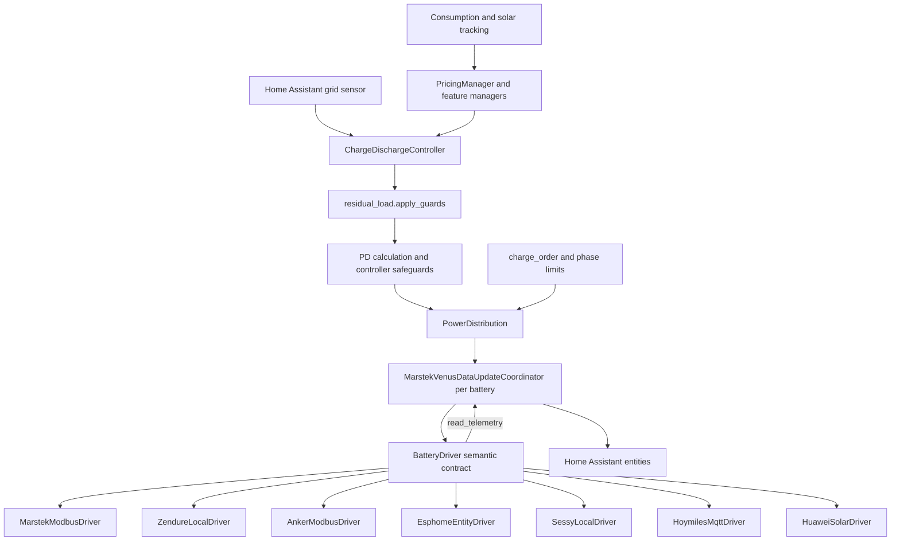

# Architecture

This page maps the current Omnibattery codebase for contributors. It shows where hardware support ends, where shared control begins, and which modules own each part of a telemetry or setpoint cycle.

## System map

Omnibattery creates one `MarstekVenusDataUpdateCoordinator` for each configured battery. The class keeps its historical name, but it coordinates every supported brand. Each coordinator owns one concrete `BatteryDriver`, its connection lock, telemetry cache, polling schedule, health state, and effective limits.

A config entry also creates one `ChargeDischargeController` for the fleet. The controller reads the Home Assistant grid sensor, combines feature blockers and overrides, calculates the fleet command, asks `PowerDistribution` to select batteries and allocate power, then writes through each coordinator and driver.

The controller and entity platforms do not use register addresses, HTTP paths, or MQTT topics. Those details stay inside `drivers/` and the transport clients in `infra/`.

## The driver boundary

`custom_components/omnibattery/drivers/base.py` defines the semantic hardware boundary:

- `BatteryDriver` represents one physical battery and owns its transport.
- `DriverCapabilities` describes static traits that shared code may branch on.
- `ReadGroup` groups logical telemetry keys by polling cadence.
- `TelemetrySnapshot` is a flat mapping of logical keys to decoded values.
- `SetpointResult` reports the applied signed command, confirmation state, measured delivery, failure reason, and any native state to merge into the coordinator cache.

The contract uses signed net power throughout: positive watts charge, negative watts discharge, and `0 W` requests idle. A driver translates that meaning into its own modes, limits, registers, services, or entities.

### Abstract `BatteryDriver` surface

| Area | Member | Responsibility |
|---|---|---|
| Identity | `capabilities` | Return the immutable `DriverCapabilities` for this device. |
| Lifecycle | `connected`, `connect()`, `close()`, `set_shutting_down()` | Own connection state and release transport resources. |
| Telemetry | `read_groups`, `read_telemetry(keys)` | Schedule and return decoded logical values; omit failed values. |
| Net control | `apply_setpoint(net_power_w, mode_hint=None, read_back=True)` | Clamp and translate a signed fleet command into device operations. |
| Entity control | `write_control(key, value)` | Handle a logical number, select, switch, or button write. |
| Command echo | `net_power_from_data(data)` | Reconstruct the currently echoed command for skip-if-unchanged logic. |
| Dependencies | `control_dependency_keys` | Keep control-critical telemetry polling even when its entity is disabled. |

The base class also provides optional hooks for DC coupling, model and serial identity, balance dependencies, supplemental discharge measurement, and a dynamic discharge ceiling.

The coordinator currently calls these concrete-driver methods by convention even though they are not abstract members of `BatteryDriver`: `apply_config()`, `set_charge_cutoff()`, `standby()`, `set_rs485_control()`, and, for drivers with an external-control gate, `get_rs485_control()`. A new driver must implement the applicable behavior and return a controlled `False` for unsupported write operations.

### Capabilities

Shared code reads `coordinator.capabilities`; it should not branch on a brand or firmware string. `DriverCapabilities` currently contains all of these fields:

| Group | Capability | Meaning |
|---|---|---|
| Control | `hardware_soc_cutoff` | The device itself enforces the configured state-of-charge (SOC) cutoffs. |
| Control | `has_force_mode` | The device exposes a distinct forced charge/discharge/idle mode. |
| Control | `has_rs485_control` | An external RS-485 or Modbus control gate can be toggled. |
| Power | `max_charge_power_w`, `max_discharge_power_w` | Inclusive per-device power envelope. |
| Power | `min_charge_power_w`, `min_discharge_power_w` | Lowest reliable non-zero command in each direction. |
| Timing | `actuator_latency_s` | Approximate physical response time used by direction-change protection. |
| Timing | `readback_latency_s` | Time before command telemetry is settled; falls back to actuator latency. |
| Timing | `engage_grace_s` | Optional allowance for a slow idle-to-active transition. |
| Telemetry | `push_telemetry` | The driver reads a push-fed cache rather than polling hardware live. |
| Telemetry | `telemetry_liveness_checked` | A push-cache read verifies freshness and can prove recovery. |
| Telemetry | `setpoint_confirm_reliable` | Immediate readback reliably reflects the command just written. |
| Solar | `has_mppt_pv` | Individual maximum power point tracking (MPPT) channels are available. |
| Solar | `has_solar_telemetry` | Independent aggregate solar telemetry is available. |
| Energy | `has_energy_counters` | Native cumulative energy counters are available. |
| Energy | `has_daily_energy_counters` | Native counters that reset daily are available. |
| Energy | `has_nominal_capacity` | The device reports nominal battery capacity. |
| Energy | `cycles_from_discharge_only` | Equivalent cycles use discharged energy rather than total throughput. |
| Diagnostics | `has_alarm_registers` | Native alarm or fault status is available. |
| Cutoffs | `charge_cutoff_range`, `discharge_cutoff_range` | Inclusive ranges exposed by hardware cutoff controls. |

The default values in `DriverCapabilities` preserve the older register-backed behavior. New drivers should declare every field deliberately; an inherited default is still a product decision.

## Supported drivers

The package exports seven concrete drivers, and `MarstekVenusDataUpdateCoordinator.__init__()` constructs all seven from the configured brand.

| File | Class | Hardware and transport |
|---|---|---|
| `drivers/marstek.py` | `MarstekModbusDriver` | Marstek Venus families over Modbus TCP or Modbus RTU. |
| `drivers/zendure.py` | `ZendureLocalDriver` | Zendure SolarFlow families through the local HTTP API. |
| `drivers/anker.py` | `AnkerModbusDriver` | Anker SOLIX Solarbank families over Modbus TCP. |
| `drivers/esphome.py` | `EsphomeEntityDriver` | Marstek hardware behind a LilyGo RS-485 bridge, using ESPHome entities in Home Assistant. |
| `drivers/sessy.py` | `SessyLocalDriver` | Sessy through its authenticated local HTTP API. |
| `drivers/hoymiles.py` | `HoymilesMqttDriver` | Hoymiles MS-A2 through Home Assistant MQTT entities. |
| `drivers/huawei.py` | `HuaweiSolarDriver` | Huawei SUN2000 with LUNA2000: native Modbus telemetry and service-based or direct setpoint writes. |

Each driver also owns its platform definition lists: `sensor_definitions`, `number_definitions`, `select_definitions`, `switch_definitions`, `binary_sensor_definitions`, `button_definitions`, and `all_definitions`. The coordinator exposes these lists to `sensor.py`, `number.py`, `select.py`, `switch.py`, `binary_sensor.py`, and `button.py`. This keeps unsupported entities out of the registry and keeps hardware metadata beside its decoder.

See [Add a battery driver](driver-requirements-template.md) for the implementation and review checklist.

## Coordinator and telemetry flow

`infra/coordinator.py::MarstekVenusDataUpdateCoordinator` is the per-device adapter between Home Assistant and a driver. It:

1. Constructs the selected concrete driver.
2. Connects it and applies setup configuration.
3. Iterates `driver.read_groups`, skips disabled non-dependency keys, and serializes I/O with its lock.
4. Merges successful `read_telemetry()` values into `coordinator.data`.
5. Tracks failures, availability, reconnect backoff, stale energy readings, and transient fast polling.
6. Exposes the driver’s definitions and capabilities to entities and shared control.
7. Sends signed commands through `apply_power()` to `driver.apply_setpoint()` and merges the returned `SetpointResult.applied` data.

The nominal read-group cadences come from `const/integration_const.py`:

| Cadence | Interval | Typical data |
|---|---:|---|
| `high` | 2 s | Power, mode, and SOC values used by control. |
| `medium` | 5 s | Voltage, current, and temperature. |
| `low` | 30 s | Energy counters and slower diagnostics. |
| `very_low` | 600 s | Device identity and firmware. |

A driver chooses the cadence for each `ReadGroup`. During a real command change, the coordinator can temporarily accelerate only groups that contain delivered-power telemetry.

## Control pipeline

`__init__.py::ChargeDischargeController` owns fleet orchestration. Its main cycle is `async_update_charge_discharge()`. The path from a grid update to hardware is:

1. Validate and normalize the configured grid sensor.
2. Refresh feature managers, blockers, manual ownership, and any active setpoint override.
3. Apply target, capacity-protection, and excluded-load adjustments.
4. Use `control/residual_load.py::apply_guards()` for feedforward, solar-surplus blocking, and the residual-demand discharge ceiling.
5. Calculate the incremental proportional–derivative (PD) command and apply controller-level deadband, direction-change, minimum-power, relay-dwell, SOC, and non-delivery safeguards.
6. Ask `PowerDistribution` to select eligible batteries and split the command within effective limits.
7. Let `PhasePowerLimiter` reduce the final per-battery allocation when three-phase protection is enabled.
8. Call `_set_battery_power()`, then `coordinator.apply_power()`, then `driver.apply_setpoint()` for each selected battery; idle batteries receive an explicit zero where the active control path requires it.

### Modules in `control/`

| Module | Class or public helpers | Role in the pipeline |
|---|---|---|
| `power_distribution.py` | `PowerDistribution` | Selects the minimum useful battery set and allocates charge or discharge within limits. |
| `charge_order.py` | `charge_order()`, `charge_allocation_weights()` | Orders mixed AC/DC fleets and weights charging by remaining capacity. |
| `residual_load.py` | `residual_demand_w()`, `apply_guards()`, `guards_pending()` | Reconstructs uncovered load and applies the shared guard pipeline. |
| `phase_power_limit.py` | `PhasePowerLimiter`, `PhaseSensorReading` | Constrains final allocations from per-phase current measurements. |
| `pack_soc.py` | `pack_socs()`, `soc_vs_ceiling()`, `soc_vs_floor()`, `control_vmax()` | Normalizes pack-level SOC and cell-voltage decisions. |
| `charge_delay.py` | `ChargeDelayManager` | Owns solar charge-delay state, forecasts, persistence, and release decisions. |
| `max_soc_charge.py` | `MaxSocChargeManager` | Applies top-of-charge taper, recalibration, and cell-delta measurement. |
| `weekly_full_charge.py` | `WeeklyFullChargeManager` | Schedules and persists periodic full-charge behavior and temporary cutoff changes. |
| `temperature_limit.py` | `TemperatureChargeLimitManager` | Derates per-battery charge and optional discharge limits from temperature. |
| `discharge_reserve.py` | `DischargeReserveManager` | Reserves energy for a later high-price period through discharge blockers. |
| `high_price_discharge.py` | `HighPriceDischargeManager` | Builds and applies deliberate high-price discharge overrides. |
| `surplus_price_hold.py` | `SurplusPriceHoldManager` | Delays solar absorption when exporting now is more valuable. |

Pure pricing calculations live under `pricing/`. `pricing/engine.py::PricingManager` coordinates price sources and evaluations, while `pricing/chronological.py` performs the chronological energy simulation without Home Assistant or device I/O. Runtime adapters in `control/` turn those plans into blockers or setpoint overrides.

## Tracking and entities

The `tracking/` package owns persisted observations and projections:

- `ConsumptionTracker` composes consumption history, daily counters, recorder backfill, and the consumption profile.
- `ConsumptionProfileTracker` stores local-day interval data and produces weighted forecasts.
- `SolarProfileTracker` learns a normalized solar-production shape.
- `BalanceMonitor` records cell-voltage spread around full charge.
- `NonResponsiveTracker` tracks failed delivery episodes and recovery.
- `HourlyBalanceManager` calculates hourly net-balance accounting.
- `DailyOperationTimelineManager` builds the diagnostic daily timeline.

The Home Assistant platform files are thin consumers of coordinator data and driver definitions. Shared derived entities live under `sensors/`; system-wide totals use `sensors/aggregate_sensors.py`, while calculated and restored values use `sensors/calculated_sensors.py`.

## Rules for architectural changes

- Put protocol, register, endpoint, topic, scaling, and sign conversion inside a concrete driver or its transport client.
- Express shared hardware differences through `DriverCapabilities` or semantic driver hooks.
- Keep the coordinator responsible for scheduling, locking, cache updates, and health; keep transport lifecycle inside the driver.
- Keep fleet decisions in `ChargeDischargeController` and `control/`; do not make a driver choose system policy.
- Return unknown or omit a telemetry key when a value cannot be trusted. Do not synthesize zero for a valid missing measurement.
- Add pure planning code under `pricing/` or `tracking/` and a runtime adapter only where Home Assistant state or controller ownership is required.
